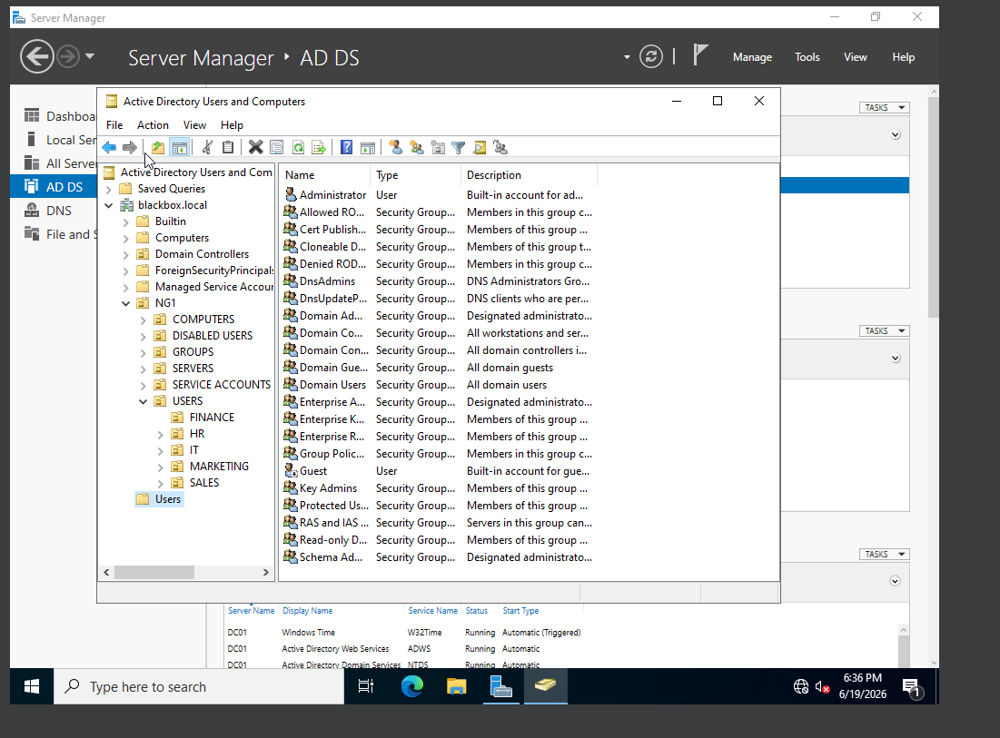
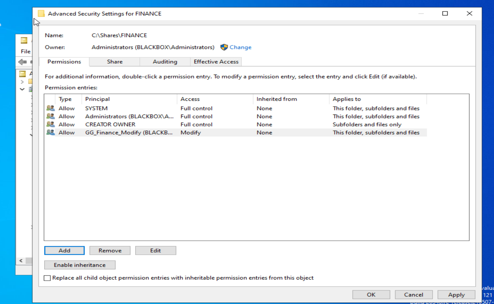
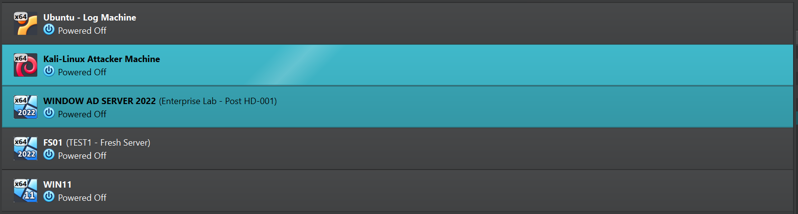

# Lab Environment

## Overview

This directory documents the baseline infrastructure used throughout the Windows Enterprise Operations Lab.

The environment is hosted in Oracle VirtualBox and is centered around the internal Active Directory domain:

```text
blackbox.local
```

The lab began as a Windows Server and Active Directory administration project. It now serves as the infrastructure for realistic Help Desk, systems administration, networking, and security operations tickets.

---

## Current Systems

| System | Operating System | Purpose | Current Status |
|---|---|---|---|
| DC01 | Windows Server 2022 | Domain Controller, DNS server, and current departmental file-share host | Operational |
| FS01 | Windows Server 2022 | Planned dedicated file server | Installed; future expansion |
| WIN11 | Windows 11 Enterprise | Planned domain workstation and end-user testing system | Installed; domain connectivity under investigation |
| Ubuntu Log Machine | Ubuntu Linux | Planned centralized logging and monitoring | Available for integration |
| Kali Linux | Kali Linux | Controlled security testing and future attack simulation | Available for future scenarios |

---

## Active Directory Services

DC01 currently provides:

- Active Directory Domain Services
- Microsoft DNS
- Domain administration
- User and group management
- Organizational Unit management
- Account and lockout policies
- Departmental shared folders
- NTFS permission management
- SMB share-permission management

---

## Organizational Unit Structure

The `blackbox.local` domain includes Organizational Units for:

```text
NG1
├── COMPUTERS
├── DISABLED USERS
├── GROUPS
│   └── Global Security Groups
├── SERVERS
├── SERVICE ACCOUNTS
└── USERS
    ├── FINANCE
    ├── HR
    ├── IT
    ├── MARKETING
    └── SALES
```

This structure separates systems, user accounts, security groups, service accounts, and disabled accounts so that they can be managed independently.



---

## Security Groups

Departmental access is assigned through Active Directory Global Security Groups rather than directly to individual users.

Examples include:

```text
GG_Finance_Read
GG_Finance_Modify

GG_HR_Read
GG_HR_Modify

GG_IT_Read
GG_IT_Modify

GG_Marketing_Read
GG_Marketing_Modify

GG_Sales_Read
GG_Sales_Modify
```

This provides a scalable role-based access-control model:

```text
User
  ↓
Department security group
  ↓
Resource permission
```


---

## User and Group Administration

Department users are placed inside the appropriate Organizational Unit and assigned access through security-group membership.

Example:

```text
James Wilson
  ↓
GG_Finance_Modify
  ↓
Finance departmental resource
```

This approach allows access to be granted or removed by changing group membership without modifying the resource permissions for each individual employee.


---

## Departmental Shared Folders

Departmental folders are currently stored on DC01 under:

```text
C:\Shares
```

Current resources include:

```text
C:\Shares\FINANCE
C:\Shares\HR
C:\Shares\IT
C:\Shares\MARKETING
C:\Shares\SALES
```

These folders will eventually be migrated or recreated on FS01 when the dedicated file-server role is implemented.


---

## Access-Control Model

Access to departmental resources is controlled through two permission layers:

```text
SMB share permissions
        +
NTFS permissions
        =
Effective user access
```

The intended Modify-access model is:

```text
SYSTEM                         Full Control
BLACKBOX\Administrators        Full Control
CREATOR OWNER                  Full Control on created objects
Department Modify Group        Modify
```

Ordinary departmental users are not granted Full Control and are not permitted to change the resource's access control list.



---

## Domain and DNS

DC01 hosts the internal DNS zone used by Active Directory:

```text
blackbox.local
```

Active Directory clients must use the Domain Controller's DNS service to locate:

- Domain Controllers
- Kerberos services
- LDAP services
- Global Catalog services
- Other Active Directory resources

Public DNS providers cannot resolve the internal `blackbox.local` domain.

---

## Virtual Lab Systems

The VirtualBox environment currently contains:

- DC01
- FS01
- WIN11
- Ubuntu Log Machine
- Kali Linux

These systems provide the foundation for future Help Desk, system-administration, networking, and security scenarios.



---

## Snapshot Strategy

The lab uses VirtualBox snapshots to preserve stable recovery points before major infrastructure changes or intentional misconfigurations.

Current important snapshots include:

```text
DC01 - Pre AD Install
DC01 - Domain Controller Complete
DC01 - AD Lab Phase 1 Complete
Enterprise Lab - Baseline
```

The `Enterprise Lab - Baseline` snapshot represents the stable environment before ticket-based operations began.

Later snapshots may be created after major milestones such as:

- File-server deployment
- Group Policy implementation
- DHCP installation
- Domain-client connectivity
- Logging integration
- Security-monitoring deployment

Minor account changes or individual password resets will not necessarily require a new snapshot.


---

## Known Environment Limitation

The Windows 11 and FS01 systems are currently unable to communicate reliably with DC01 for domain joining inside the existing VirtualBox network configuration.

The investigation established that:

- DC01 is operational.
- Active Directory and DNS are installed.
- User and group administration functions correctly.
- The client systems have experienced virtual-network connectivity and name-resolution problems.
- Domain-join-dependent verification cannot currently be completed reliably.

This limitation is documented openly so that ticket results do not claim workstation testing that did not occur.

Server-side investigation and verification can still be performed using:

- Active Directory Users and Computers
- NTFS permissions
- SMB share permissions
- Effective Access
- DNS Manager
- Server Manager
- Event Viewer
- PowerShell
- Windows administrative tools

Resolving or replacing the current virtual-network configuration remains a future infrastructure task.

---

## Baseline Evidence

The files stored in this directory document the environment before additional ticket scenarios and infrastructure expansions.

| Screenshot | Evidence Provided |
|---|---|
| `01-active-directory-structure.png` | Organizational Units and departmental structure |
| `02-security-groups.png` | Global Security Groups used for role-based access |
| `03-user-group-membership.png` | Example user-to-group access assignment |
| `04-departmental-shares.png` | Departmental folder structure |
| `05-ntfs-permissions.png` | Example departmental NTFS permission model |
| `06-virtualbox-systems.png` | Available virtual machines |
| `07-enterprise-lab-baseline.png` | Stable VirtualBox recovery snapshot |

These screenshots represent infrastructure evidence. Screenshots gathered during individual investigations are stored inside the corresponding ticket folder.

Example:

```text
tickets/
└── HD-001-Finance-User-Cannot-Modify-Department-Share/
    ├── README.md
    └── images/
```

---

## Planned Infrastructure Expansion

Future changes may include:

- Moving file shares from DC01 to FS01
- Establishing reliable communication between the virtual systems
- Joining WIN11 and FS01 to `blackbox.local`
- Installing and configuring DHCP
- Deploying Group Policy
- Mapping departmental drives
- Adding printer services
- Configuring Windows Event Forwarding
- Integrating Sysmon
- Sending logs to the Ubuntu monitoring system
- Adding vulnerability management
- Building controlled attack-and-defense scenarios
