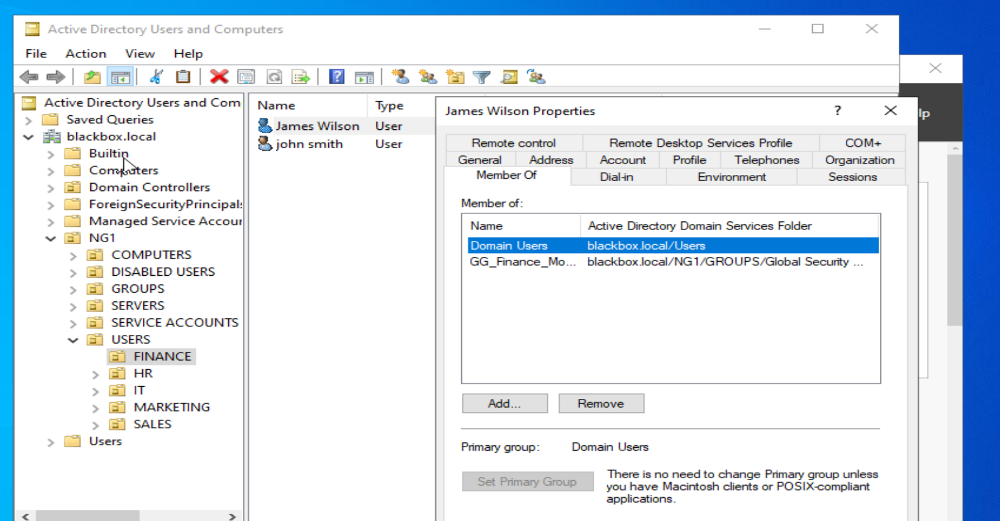
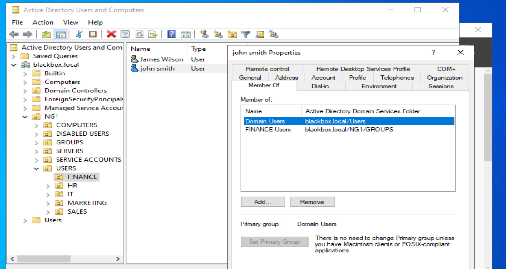
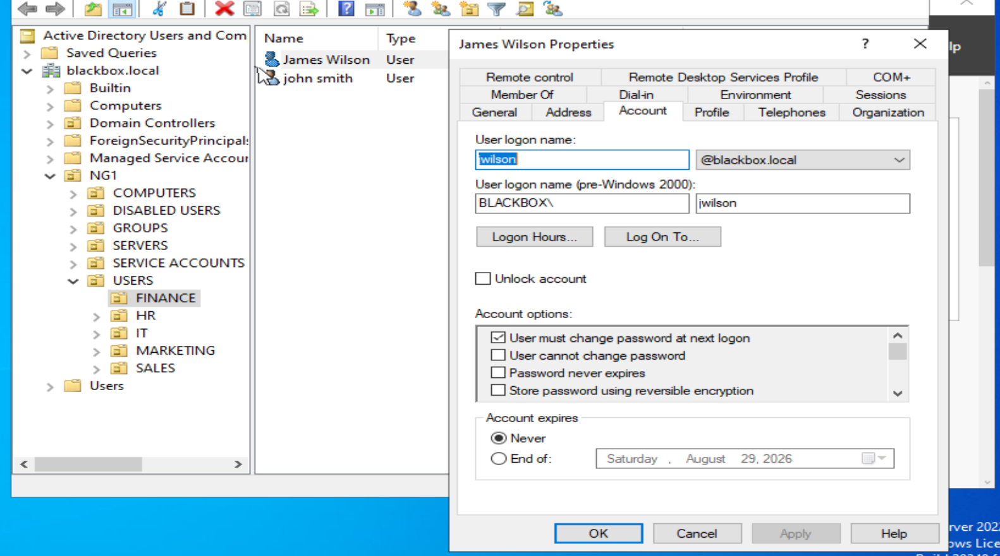
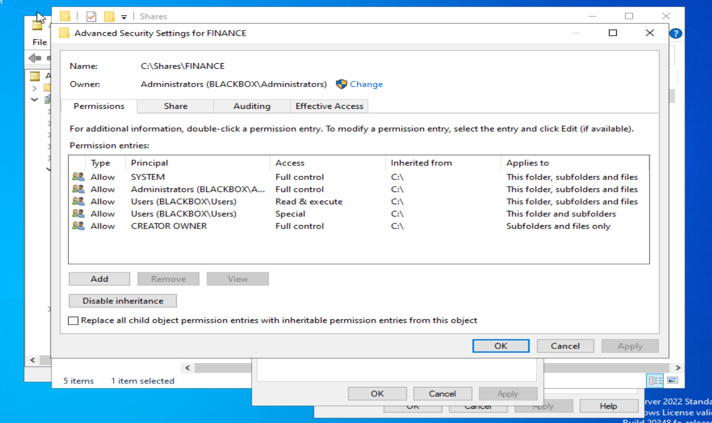
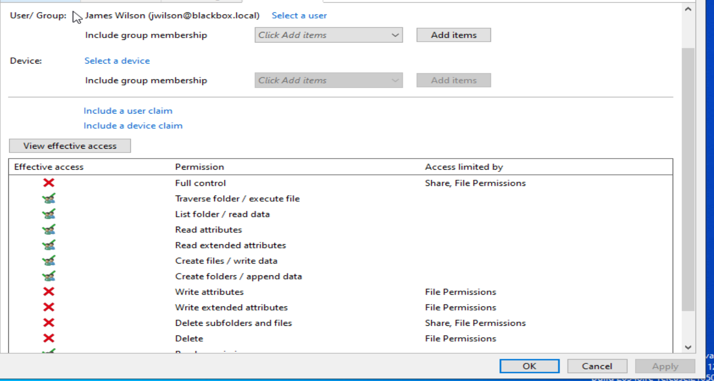
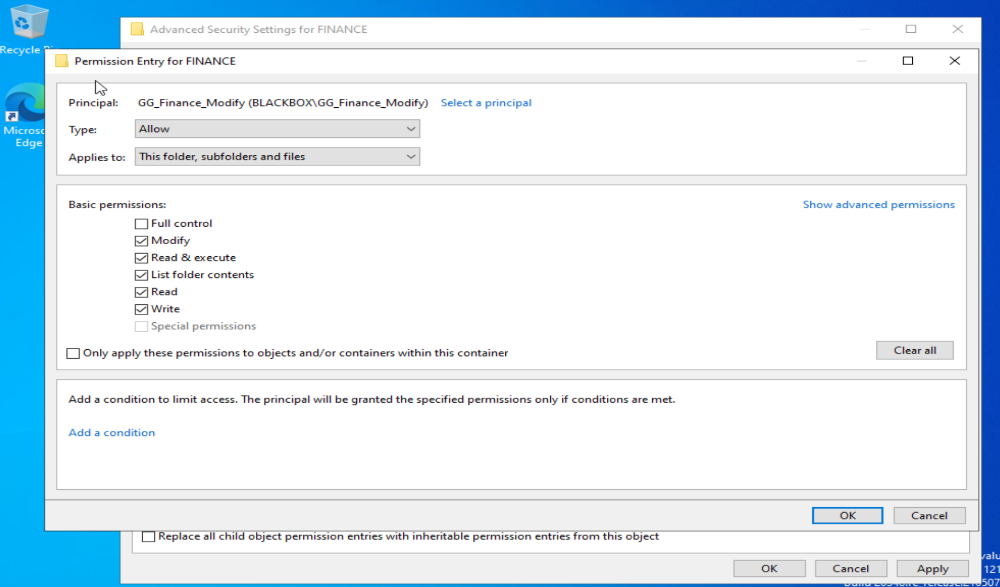
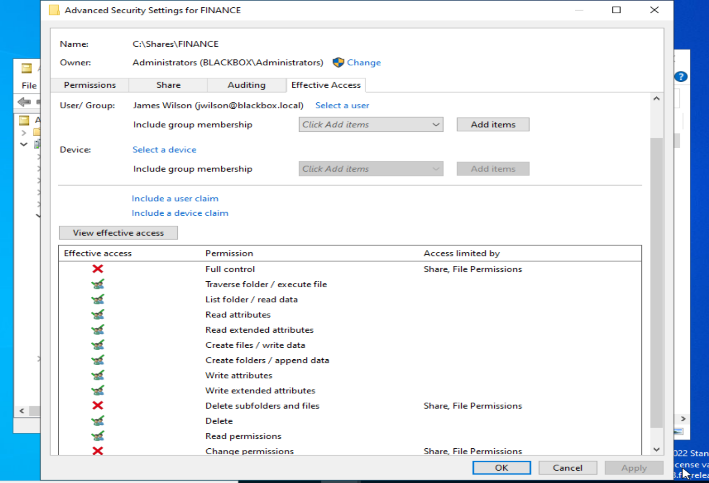

# HD-001 — Finance User Cannot Modify Department Share

## Ticket Summary

| Field         | Details                                                                        |
| ------------- | ------------------------------------------------------------------------------ |
| Ticket Number | HD-001                                                                         |
| Title         | Finance User Cannot Modify Department Share                                    |
| User          | James Wilson                                                                   |
| Department    | Finance                                                                        |
| Priority      | Medium                                                                         |
| Status        | Resolved — server-side verification completed                                  |
| Environment   | Windows Server 2022, Active Directory, NTFS permissions, SMB share permissions |

---

## User Description

James Wilson reported that he could still open files stored in the Finance department folder, but could no longer save changes or create new documents.

According to the user, the folder worked normally the previous day. Other Finance employees had not reported the same problem.

---

## Environment and Background

The lab environment contains:

* Windows Server 2022 Domain Controller
* Active Directory Domain Services
* Departmental Organizational Units
* Departmental security groups
* Finance shared folder
* NTFS permissions
* SMB share permissions
* Role-based access through Active Directory group membership

The Finance resource is stored at:

```text
C:\Shares\FINANCE
```

The security group intended to provide modification rights is:

```text
BLACKBOX\GG_Finance_Modify
```

---

## Initial Symptoms

The initial report established the following:

* James could reach the Finance folder.
* James could browse and open existing documents.
* James could not save changes normally.
* James could not create documents successfully in the Finance share.
* James could create files on his local desktop.
* The issue appeared limited to one user.
* The resource had reportedly worked the previous day.

These symptoms suggested that basic connectivity and read access were functioning, while some portion of the write or modify permission set was missing.

---

## Initial Investigation Plan

Before making changes, the investigation focused on:

1. Verifying that James's Active Directory account was active.
2. Reviewing his security-group memberships.
3. Comparing his memberships with another Finance employee.
4. Reviewing the Finance folder's current NTFS access control list.
5. Calculating James's Effective Access.
6. Identifying whether the issue originated from the user account, security group, NTFS permissions, or share permissions.
7. Applying the smallest justified correction.
8. Recalculating Effective Access after the change.

---

## Investigation Process

### 1. Reviewed James Wilson's Group Membership

James's Active Directory account was reviewed through Active Directory Users and Computers.

He was a member of:

```text
Domain Users
GG_Finance_Modify
```

This established that James was already assigned to the intended role-based access group.



---

### 2. Compared Another Finance User

John Smith's membership was reviewed for comparison.

John was a member of:

```text
Domain Users
FINANCE-Users
```

`FINANCE-Users` was an older departmental group from an earlier phase of the lab. It was not assumed to provide the same access as `GG_Finance_Modify` without confirming its relationship to the folder's permissions.

The comparison reinforced the importance of checking the resource's actual access control list rather than assuming that departmental placement alone granted access.



---

### 3. Reviewed James's Account Status

James's account properties were reviewed for signs of account lockout, expiration, disablement, or other account-level restrictions.

The account was not identified as disabled. The option requiring a password change at the next logon was enabled, but that setting did not explain why an existing session could read files while lacking the permissions required for normal document modification.



---

### 4. Inspected the Finance Folder's NTFS Permissions

The advanced security settings for `C:\Shares\FINANCE` showed that the folder was inheriting generic permissions from `C:\`.

The active entries included:

```text
SYSTEM                         Full Control
Administrators                 Full Control
Users                          Read & Execute
Users                          Special
CREATOR OWNER                  Full Control
```

The expected entry was missing:

```text
BLACKBOX\GG_Finance_Modify
```

This was the first strong indication that the problem existed on the resource rather than in James's Active Directory account.



---

### 5. Calculated James Wilson's Effective Access

Windows Effective Access was used to calculate the permissions James actually received after combining:

* His user account
* His group memberships
* NTFS permissions
* Share permissions

The result showed that James could:

* Traverse the folder
* List folder contents
* Read file data
* Read attributes
* Create some files and folders

However, he lacked several permissions required for normal document modification, including:

* Write attributes
* Write extended attributes
* Delete
* Delete subfolders and files
* Complete Modify-level access

This explained why the issue was more complicated than a simple read-only condition.

Applications such as Microsoft Word may create temporary files, update file attributes, rename files, or replace the original document during the save process. Partial write access may therefore still result in failed saves.



---

## Findings

The investigation established that:

* James's Active Directory account was assigned to the correct security group.
* The problem was not caused by missing group membership.
* The Finance folder's NTFS ACL did not contain `GG_Finance_Modify`.
* Generic inherited permissions allowed partial access.
* Partial access explained why James could open files but could not save changes normally.
* Effective Access confirmed that required Modify-related permissions were missing.

---

## Root Cause

The Finance folder was inheriting generic permissions from `C:\`, and its NTFS access control list did not grant `BLACKBOX\GG_Finance_Modify` the complete Modify permission set.

Because James belonged to `GG_Finance_Modify` but the group was absent from the folder's ACL, his membership did not provide the intended departmental access.

The inherited `Users` entries preserved read and limited creation rights, producing the misleading symptom that James could access the folder but could not modify its contents normally.

---

## Resolution

The Finance folder's permissions were corrected using the following process:

1. Opened the advanced security settings for:

   ```text
   C:\Shares\FINANCE
   ```

2. Disabled inheritance.

3. Converted inherited permissions into explicit permissions.

4. Removed the generic `BLACKBOX\Users` entries.

5. Added:

   ```text
   BLACKBOX\GG_Finance_Modify
   ```

6. Granted the group:

   ```text
   Modify
   ```

7. Applied the permission to:

   ```text
   This folder, subfolders and files
   ```

8. Retained the required administrative entries:

   ```text
   SYSTEM                         Full Control
   BLACKBOX\Administrators        Full Control
   CREATOR OWNER                  Full Control
   BLACKBOX\GG_Finance_Modify     Modify
   ```

No Deny entries were created.



The resulting NTFS ACL reflected the intended least-privilege permission model.


---

## Verification

Effective Access was recalculated for James Wilson after the correction.

The updated result showed that James now received the permissions required for normal document modification, including:

* Traverse folder / execute file
* List folder / read data
* Create files / write data
* Create folders / append data
* Write attributes
* Write extended attributes
* Delete
* Read permissions

James did not receive Full Control or permission to change the folder's ACL. Those restrictions were expected because departmental users require Modify access, not administrative ownership of the resource.



### Verification Limitation

A live save test from James's workstation could not be completed because the current virtual lab does not yet have a functioning domain-joined Windows client.

Verification was therefore based on:

* Active Directory group membership
* The corrected NTFS ACL
* Windows Effective Access calculations
* Before-and-after permission comparison

---

## Final Result

The Finance folder now grants Modify access through the appropriate Active Directory security group.

James Wilson's membership in `GG_Finance_Modify` now translates into the intended departmental permissions without granting unnecessary administrative control.

The server-side configuration issue was resolved successfully.

---

## Lessons Learned

### Group membership does not guarantee access

A user can belong to the correct Active Directory group while still lacking access if the resource does not reference that group in its ACL.

The complete path must be verified:

```text
User
  ↓
Security-group membership
  ↓
Share permissions
  ↓
NTFS permissions
  ↓
Effective Access
```

### Read access does not prove Modify access

A user may be able to browse folders and open files while still lacking permissions required to save, rename, replace, or delete documents.

### Application behavior matters

Applications may require more than basic write-data permission. Microsoft Office applications commonly interact with temporary files, metadata, file replacement, and deletion operations during the save process.

### Effective Access is stronger evidence than assumptions

Reviewing group membership suggested that James should have access. Effective Access showed what Windows actually allowed after evaluating the full permission path.

### Investigate before changing settings

The issue could have been misdiagnosed as a user-account or group-membership problem. Reviewing the account, ACL, and Effective Access before applying a fix prevented unnecessary Active Directory changes.

---

## Administrator Reflection

My initial hypothesis was that the issue involved permissions because James could access and read files but could not modify them.

I first verified the user-specific conditions because only James appeared to be affected. His account was active and he belonged to `GG_Finance_Modify`, which ruled out a simple missing-group-membership explanation.

The most important evidence came from the Finance folder's advanced NTFS permissions and the Effective Access calculation. The folder was inheriting generic permissions from `C:\`, while the intended Finance Modify group was missing from the ACL.

This ticket reinforced that troubleshooting should follow the complete access path instead of stopping after confirming that a user belongs to the expected group.

In a production environment, I would complete the investigation by asking the user to sign out and back in if group membership had changed, testing the share from the affected workstation, confirming document creation and modification, and documenting the user's final confirmation before closing the ticket.
