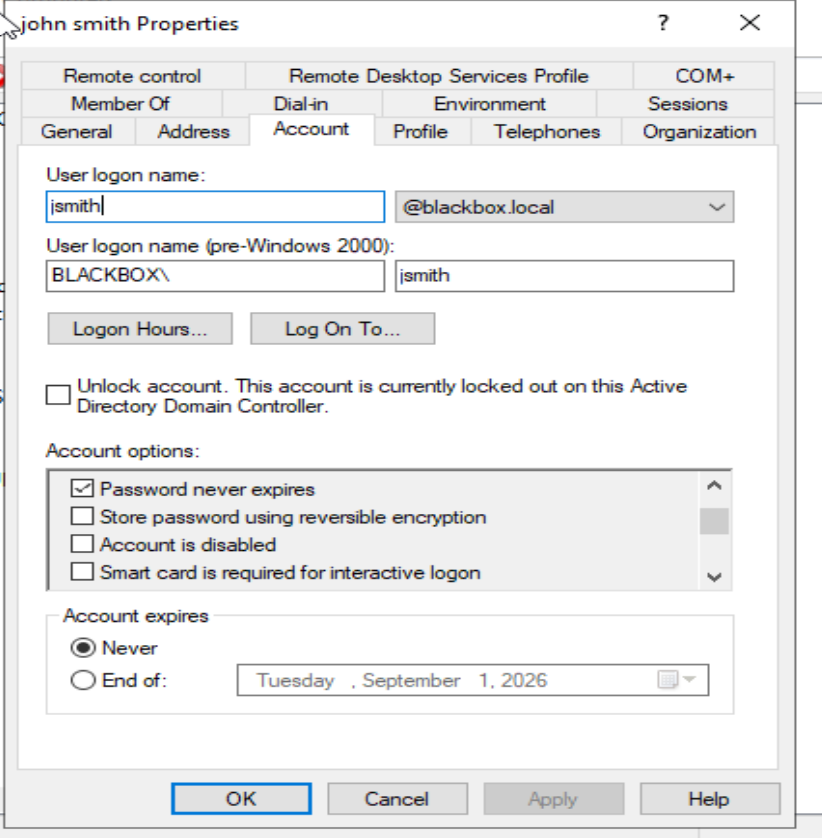
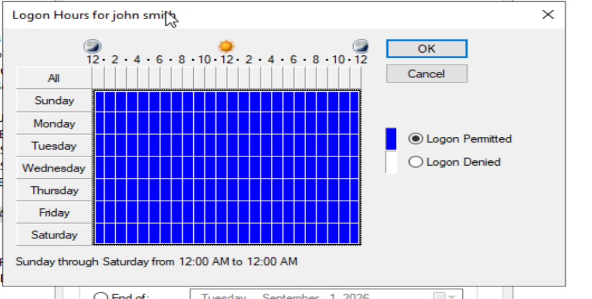
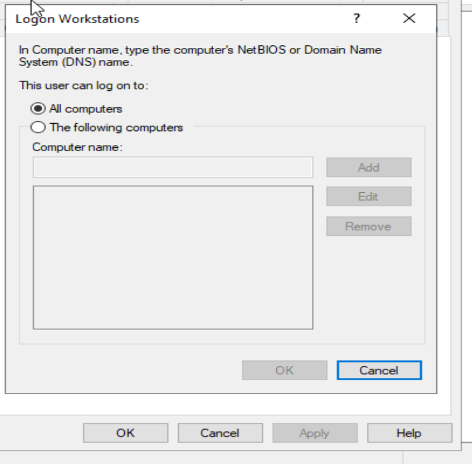
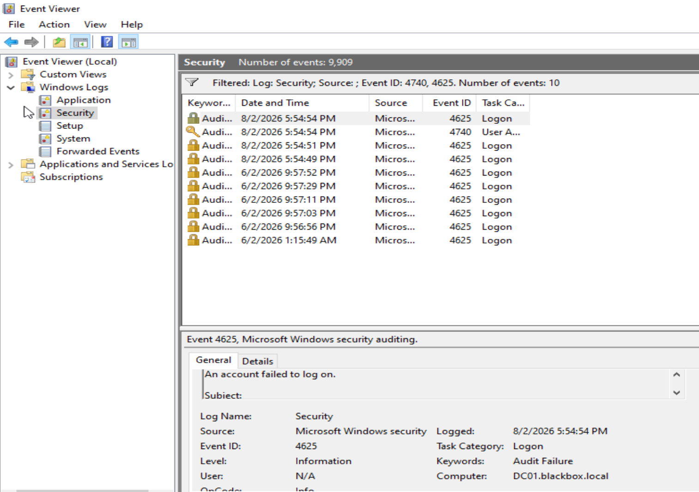
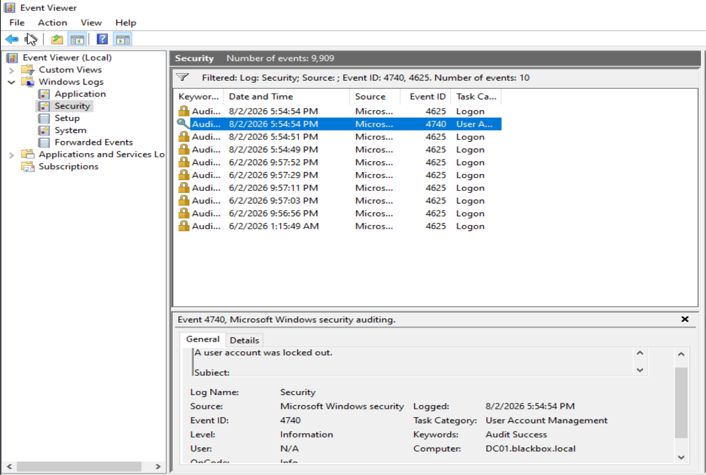
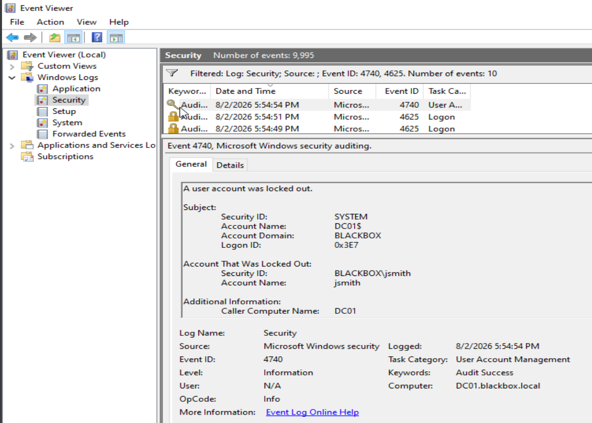
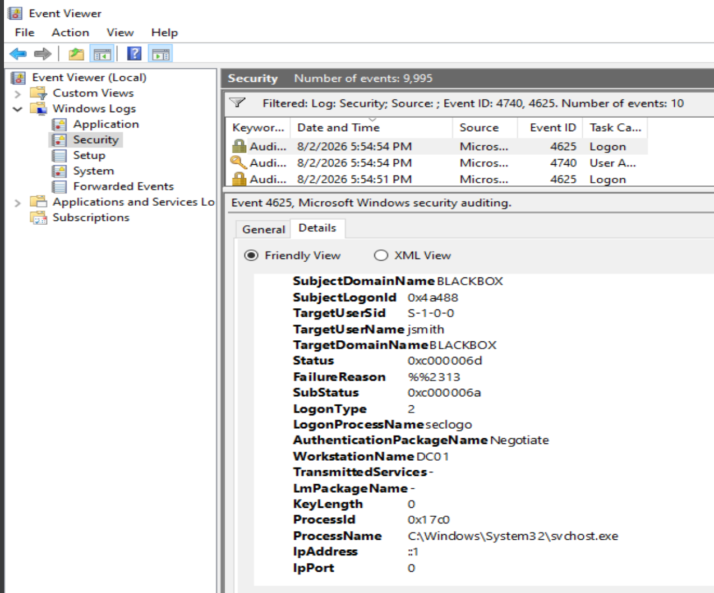
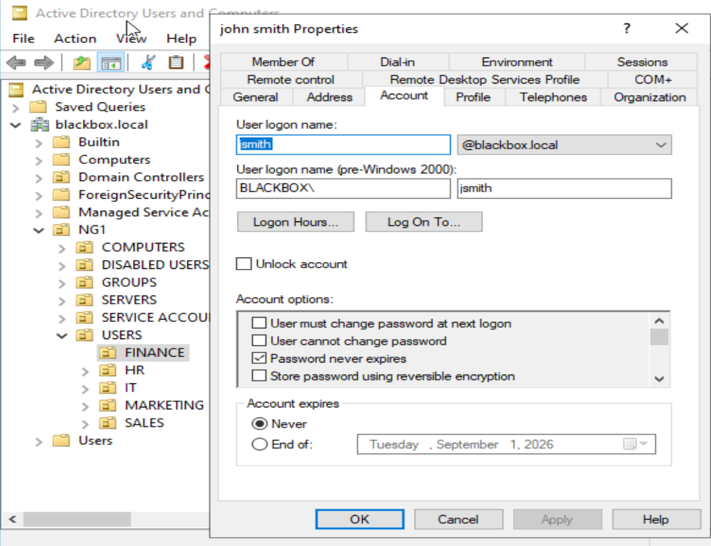

# HD-002 — Finance User Cannot Sign In

## Ticket Summary

| Field | Details |
|---|---|
| Ticket Number | HD-002 |
| Title | Finance User Cannot Sign In |
| User | John Smith |
| Department | Finance |
| Priority | High |
| Status | Resolved — server-side verification completed |
| Environment | Windows Server 2022, Active Directory Domain Services, Event Viewer, domain account administration |

---

## User Description

John Smith reported that he could no longer sign in using his domain credentials.

He stated that authentication had worked earlier in the day and that he did not remember changing his password. He had attempted to sign in several times and needed access to Finance resources before the end of the day.

---

## Environment and Background

The affected account exists inside the `blackbox.local` Active Directory domain.

The environment currently includes:

- Windows Server 2022 Domain Controller
- Active Directory Domain Services
- Active Directory Users and Computers
- Domain account lockout policy
- Windows Security event logging
- Departmental user accounts and security groups

Affected account:

```text
BLACKBOX\jsmith
```

User principal name:

```text
jsmith@blackbox.local
```

The domain account lockout policy is configured to lock an account after repeated unsuccessful authentication attempts.

---

## Initial Symptoms

The initial report established the following symptoms:

- John could authenticate earlier in the day.
- He later began receiving a credential-related sign-in error.
- He stated that he had not intentionally changed his password.
- He attempted to sign in multiple times.
- The problem appeared isolated to John.
- There was no evidence of a department-wide authentication outage.
- John required access to Finance resources before the end of the business day.

---

## Known Facts

Before making any changes, the following facts were documented:

- The account had worked previously.
- The issue affected one user.
- The reported error involved authentication credentials.
- John did not report intentionally changing his password.
- No other Finance users had reported the same issue.
- The source, number, and cause of the failed authentication attempts had not yet been verified.
- The account status had not yet been confirmed in Active Directory.
- The user’s identity would need to be verified before an unlock or password reset.

The account lockout was treated as a hypothesis until confirmed through Active Directory and Windows Security logs.

---

## Initial Investigation Plan

The investigation was designed to avoid immediately resetting the password without understanding the cause.

The initial plan was to:

1. Verify John’s identity before making account changes.
2. Confirm the exact username being used.
3. Inspect the Active Directory account status.
4. Determine whether the account was:
   - Locked
   - Disabled
   - Expired
   - Restricted by logon hours
   - Restricted to specific workstations
5. Review Windows Security logs for:
   - Event ID `4740` — user account lockout
   - Event ID `4625` — failed logon attempt
6. Correlate timestamps between failed authentication attempts and the lockout event.
7. Identify the originating workstation or system.
8. Determine whether the activity appeared consistent with user error, stale credentials, or suspicious behavior.
9. Apply the smallest justified corrective action.
10. Verify that the account was restored without causing another lockout.

---

## Investigation Process

### 1. Reviewed the Active Directory Account Status

John Smith’s account was opened in Active Directory Users and Computers.

The Account tab confirmed:

- Username: `jsmith`
- Domain: `blackbox.local`
- Account enabled: Yes
- Account expired: No
- Account locked: Yes
- Password configured not to expire
- No indication that the account had been disabled

The visible lockout message confirmed that the account was currently locked on the Domain Controller.



---

### 2. Reviewed Logon-Hour Restrictions

John’s permitted logon hours were reviewed to determine whether access was being denied because of a time-based restriction.

The account was permitted to log on at all hours, seven days per week.

This ruled out logon-hour restrictions as the cause.



---

### 3. Reviewed Workstation Restrictions

The **Log On To** configuration was inspected to determine whether John was restricted to specific domain computers.

The account was configured to allow logon to all computers.

This ruled out workstation restrictions as the cause of the sign-in failure.



---

### 4. Filtered the Windows Security Log

Event Viewer was opened on DC01 and the Security log was filtered for:

```text
4740
4625
```

The resulting timeline showed multiple failed logon attempts followed immediately by an account-lockout event.

Recent events included:

```text
5:54:49 PM — Event ID 4625
5:54:51 PM — Event ID 4625
5:54:54 PM — Event ID 4625
5:54:54 PM — Event ID 4740
```

This established that the account lockout followed three failed authentication attempts occurring within approximately five seconds.



---

### 5. Reviewed Event ID 4740

Event ID `4740` confirmed that a user account had been locked out.

The event identified:

```text
Account Name: jsmith
Account Domain: BLACKBOX
Caller Computer Name: DC01
Computer: DC01.blackbox.local
Logged: 8/2/2026 5:54:54 PM
```

The event confirmed that John Smith’s account was the locked account and that the lockout originated from DC01.



A second view of the same lockout event was retained to show the complete event details and caller-computer information.



---

### 6. Reviewed Event ID 4625

A corresponding failed-logon event was reviewed.

The event contained:

```text
TargetUserName: jsmith
TargetDomainName: BLACKBOX
Status: 0xC000006D
SubStatus: 0xC000006A
LogonType: 2
WorkstationName: DC01
IpAddress: ::1
ProcessName: C:\Windows\System32\svchost.exe
```

Interpretation:

```text
0xC000006D = Authentication or logon failure
0xC000006A = Incorrect password
Logon Type 2 = Interactive logon
::1 = Local IPv6 loopback address
```

The event showed that an incorrect password was submitted for `jsmith` during an interactive logon attempt originating locally from DC01.



---

## Evidence Collected

The investigation produced the following evidence:

| Evidence | Result |
|---|---|
| Active Directory account status | Account enabled but locked |
| Account expiration | Not expired |
| Logon hours | Unrestricted |
| Workstation restrictions | None |
| Event ID 4625 | Incorrect password submitted for `jsmith` |
| Event ID 4740 | `jsmith` locked out |
| Caller computer | DC01 |
| Source address | Local loopback address |
| Logon type | Interactive |
| Timeline | Three failures followed by immediate lockout |

The evidence did not indicate a remote source.

The authentication attempts originated locally from DC01 and occurred within a very short period.

---

## Findings

The investigation established that:

- John’s account was enabled.
- The account was not expired.
- Logon hours were not restricting access.
- Workstation restrictions were not restricting access.
- The account was locked.
- Security logs recorded repeated failed logon attempts.
- The failures involved the correct username but an incorrect password.
- The attempts originated locally from DC01.
- The account lockout occurred immediately after the failed attempts.
- There was no evidence in this investigation of a remote authentication attack.

The failed authentication sequence was consistent with repeated incorrect-password entry.

---

## Root Cause

John Smith’s domain account was locked after repeated interactive authentication attempts were made using an incorrect password.

The configured domain lockout threshold was reached, causing Active Directory to prevent further authentication attempts for the account.

The Windows Security logs confirmed:

```text
Three Event ID 4625 failures
        ↓
Incorrect password for BLACKBOX\jsmith
        ↓
Event ID 4740 account lockout
```

The evidence showed that the attempts originated locally from DC01.

---

## Resolution

After reviewing the account configuration and Security logs, the following actions were taken:

1. Verified the user’s identity before making account changes.
2. Confirmed the username as:

   ```text
   BLACKBOX\jsmith
   ```

3. Unlocked the account through Active Directory Users and Computers.
4. Confirmed that the lockout condition was removed.
5. Assigned a temporary password because the existing password was unknown in the lab.
6. Configured the account to require a password change at the next interactive logon.
7. Avoided repeated authentication attempts after the available verification method continued to fail.

The password reset was performed because the existing password was unavailable, not because the logs proved that the account had been compromised.

---

## Verification

The Account tab was reopened after the unlock operation.

The previous message stating that the account was locked no longer appeared.

Server-side verification confirmed that:

- The account remained enabled.
- The account was no longer marked as locked.
- The account was not expired.
- Logon hours remained unrestricted.
- Workstation access remained unrestricted.
- A temporary password had been assigned.
- A password change was required at the next interactive logon.



---

## Verification Limitations

A complete end-user authentication test could not be performed because the lab does not currently have a functioning domain-joined Windows workstation for John Smith.

An attempted `runas` authentication test from DC01 continued to return a username-or-password error after the account was unlocked and the temporary password was assigned.

The test was stopped rather than repeatedly attempting authentication and risking another account lockout.

The verification performed for this ticket was therefore limited to:

- Active Directory account status
- Account unlock confirmation
- Password-reset administration
- Security-event correlation
- Account restriction review
- Server-side configuration validation

In a production environment, the ticket would remain pending until John successfully signed in from his normal domain workstation and confirmed access to Finance resources.

---

## Final Result

John Smith’s account lockout was identified and removed.

Security logs confirmed that the lockout resulted from repeated incorrect-password attempts originating locally from DC01.

The account remained enabled and unrestricted, and a temporary password was assigned because the original password was unknown.

The account was configured to require a password change at the next interactive logon.

Server-side remediation was completed successfully. Final end-user confirmation would still be required in a production environment.

---

## Lessons Learned

### A credential error does not automatically mean the password changed

Windows may display a general credential-related error when the real condition is an account lockout.

The account status should be checked before assuming the user simply forgot the password.

### Unlocking the account is only part of the investigation

Immediately unlocking an account restores access temporarily but does not explain why it became locked.

Security logs should be reviewed to identify:

- The failed account
- Failure reason
- Number of attempts
- Source workstation
- Source address
- Logon type
- Lockout timestamp

### Event IDs should be correlated

Event ID `4625` showed the individual authentication failures.

Event ID `4740` confirmed the resulting account lockout.

The sequence provided stronger evidence than either event alone.

### Windows does not record the password entered

Security logs can show that an incorrect password was used, but they do not reveal the actual password submitted.

This protects credentials and limits the investigation to metadata such as account, source, time, and failure code.

### Source context matters

The events showed:

```text
WorkstationName: DC01
IpAddress: ::1
```

This indicated a local source rather than a remote network host.

That reduced the likelihood of a remote password attack in this specific scenario.

### Avoid repeated testing that recreates the incident

After the available authentication test continued to fail, additional attempts were stopped.

Continuing could have locked the account again and created misleading log data.

A technician should recognize when a verification method is no longer producing useful evidence.

### Identity verification comes before password resets

Account unlocks and password resets affect access to business resources.

The user’s identity should be confirmed before either action is performed.

---

## Administrator Reflection

My initial possibilities included an incorrect password, Caps Lock, an outdated password, an incorrect username, an account restriction, or an account lockout.

I first checked John’s account properties because this was a fast and non-invasive way to confirm the username, account status, expiration, and restrictions without changing anything.

The Account tab confirmed the lockout, but I did not stop there. I reviewed the Security log to determine what caused it.

The strongest evidence came from correlating Event IDs `4625` and `4740`. Three incorrect-password events occurred within several seconds and were followed immediately by the account-lockout event.

The source fields showed that the attempts originated locally from DC01, which did not support a remote attack hypothesis.

This ticket reinforced the importance of distinguishing between the symptom and the cause:

```text
Symptom: User cannot sign in
Cause: Account locked after repeated incorrect-password attempts
```

It also showed why a technician should not immediately reset a password based only on the user’s description. Account configuration and event logs can provide objective evidence before corrective action is taken.

In a production environment, I would complete verification by having John sign in from his normal workstation, change the temporary password, confirm access to Finance resources, and report whether any other device or application was storing an outdated credential.
