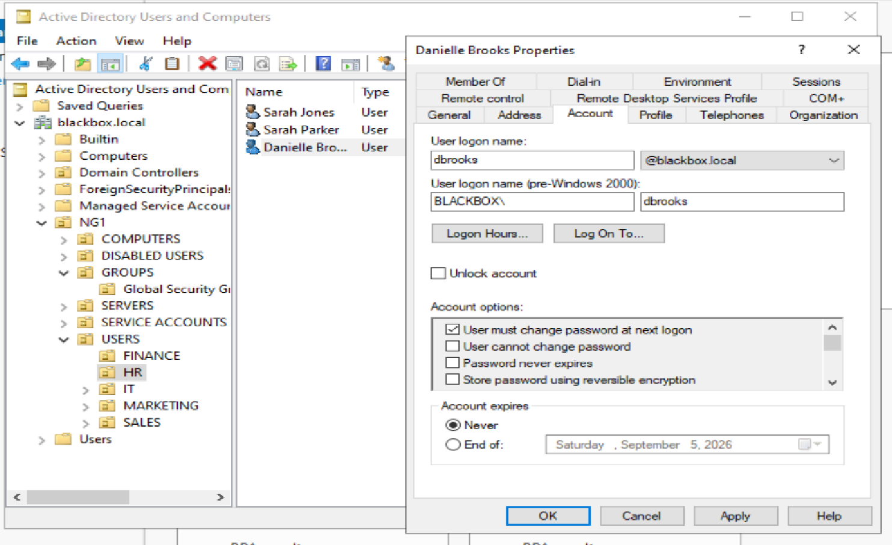
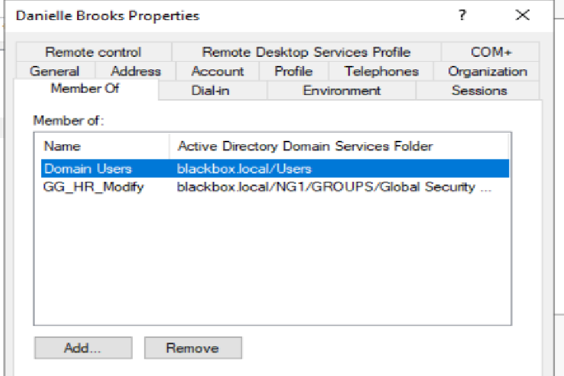
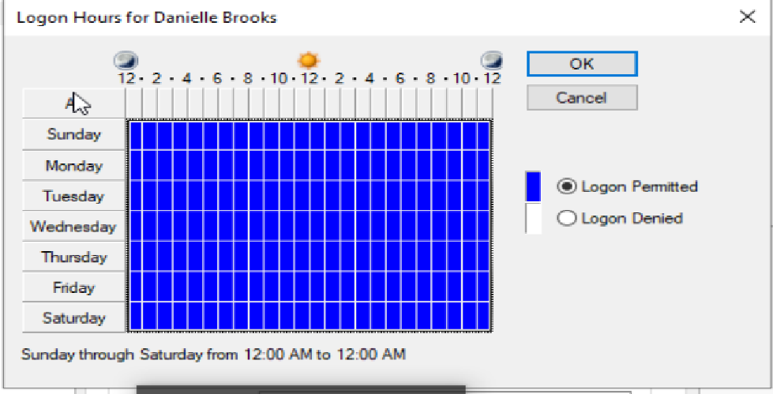
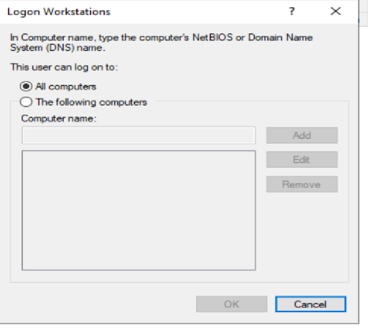

# HD-003 — New HR Employee Onboarding

## Ticket Summary

| Field | Details |
|---|---|
| Ticket Number | HD-003 |
| Title | New HR Employee Onboarding |
| User | Danielle Brooks |
| Department | Human Resources |
| Priority | Medium |
| Status | Resolved — server-side provisioning completed |
| Environment | Windows Server 2022, Active Directory Domain Services, Active Directory Users and Computers |

---

## User Description

HR submitted a request to provision a new employee account for Danielle Brooks, who was joining the Human Resources department as an HR Coordinator.

The original request stated that Danielle required standard HR access and access to the HR departmental files.

Because the requested access level was initially ambiguous, additional clarification was obtained before the account was created.

---

## Environment and Background

The environment uses the internal Active Directory domain:

```text
blackbox.local
```

The Human Resources Organizational Unit is located at:

```text
blackbox.local
└── NG1
    └── USERS
        └── HR
```

Departmental access is assigned through Active Directory security groups rather than directly to individual user accounts.

Relevant HR groups include:

```text
GG_HR_Read
GG_HR_Modify
```

Danielle's role required the ability to:

- Open HR files
- Create new HR files
- Edit existing HR files
- Delete HR files

She did not require access to resources belonging to other departments.

---

## Initial Symptoms

This ticket was an onboarding request rather than a break/fix incident.

The initial request contained:

- Employee first and last name
- Department
- Job title
- Manager
- Requested start date
- Requirement for HR departmental access

However, the phrase "standard HR access" did not identify the exact level of access required.

No username convention, account-expiration requirement, logon restriction, or workstation restriction was included in the initial request.

---

## Known Facts

Before creating the account, the following facts were established:

- Danielle Brooks was a new employee rather than an internal transfer.
- She was joining the Human Resources department.
- Her job title was HR Coordinator.
- She required access to HR departmental files.
- She did not require access to any other department.
- The organization uses a username format of first initial plus last name.
- No account expiration was required.
- No special logon-hour restrictions were required.
- No workstation restrictions were required.
- A temporary password should be assigned.
- The user should be required to change the password at first sign-in.

Approved username:

```text
dbrooks
```

Approved access level:

```text
GG_HR_Modify
```

---

## Initial Investigation Plan

Before creating the account, the onboarding process was reviewed to prevent duplicate accounts or excessive access.

The plan was to:

1. Confirm that Danielle was a new hire rather than an internal transfer.
2. Verify the requested level of HR access.
3. Confirm the organization's username convention.
4. Check Active Directory for an existing `dbrooks` account.
5. Create the account inside the HR Organizational Unit.
6. Assign a temporary password.
7. Require a password change at next logon.
8. Leave account expiration set to Never.
9. Leave logon hours unrestricted.
10. Leave workstation restrictions unrestricted.
11. Add Danielle only to the security group required for her job duties.
12. Verify account properties and group membership before closing the ticket.

---

## Investigation Process

### 1. Confirmed Required Access

The original request for "standard HR access" was treated as ambiguous.

Additional clarification established that Danielle needed the ability to:

- Read HR files
- Create HR files
- Modify HR files
- Delete HR files

This justified membership in:

```text
GG_HR_Modify
```

rather than:

```text
GG_HR_Read
```

No access to Finance, IT, Marketing, Sales, or other departmental resources was approved.

---

### 2. Checked for an Existing Account

Active Directory Users and Computers was reviewed to verify that the proposed username did not already exist.

The approved username was:

```text
dbrooks
```

No conflicting account was identified.

A new account was therefore appropriate.

---

### 3. Created the User in the HR Organizational Unit

Danielle Brooks was created inside:

```text
NG1
└── USERS
    └── HR
```

The account was configured with:

```text
User logon name: dbrooks
UPN: dbrooks@blackbox.local
Pre-Windows 2000 logon name: BLACKBOX\dbrooks
```

A temporary password was assigned and:

```text
User must change password at next logon
```

was enabled.

The account was configured with no expiration requirement.



---

### 4. Assigned Role-Based Group Membership

Danielle was added to:

```text
GG_HR_Modify
```

Her resulting group membership included:

```text
Domain Users
GG_HR_Modify
```

No unnecessary departmental security groups were assigned.

This preserved the least-privilege access model used throughout the lab.



---

### 5. Verified Logon Hours

Danielle's logon-hour configuration was reviewed.

The account was permitted to log on:

```text
Sunday through Saturday
12:00 AM through 12:00 AM
```

This confirmed that no unintended time-based restriction had been introduced during provisioning.



---

### 6. Verified Workstation Restrictions

The **Log On To** configuration was reviewed.

The account was permitted to log on to:

```text
All computers
```

No workstation-specific restriction had been configured.



---

## Evidence Collected

The onboarding verification produced the following evidence:

| Evidence | Result |
|---|---|
| Account location | HR Organizational Unit |
| Username | `dbrooks` |
| Account status | Enabled |
| Password handling | Temporary password assigned |
| Password change requirement | Enabled for next logon |
| Account expiration | Never |
| Department group | `GG_HR_Modify` |
| Other department access | None assigned |
| Logon hours | Unrestricted |
| Workstation restrictions | None |

---

## Findings

The completed review established that:

- Danielle was provisioned as a new domain user.
- The account was created inside the correct HR Organizational Unit.
- The username followed the approved naming convention.
- The account was configured for first-logon password change.
- The account was not unnecessarily restricted by time or workstation.
- HR Modify access was granted through the correct security group.
- No unrelated departmental permissions were assigned.
- Access was granted through role-based group membership rather than directly to the user.

---

## Root Cause

This ticket did not involve a technical fault.

The primary administrative risk was ambiguity in the original access request.

The phrase:

```text
standard HR access
```

was insufficient to determine whether the new employee required read-only or modify access.

Clarifying the request before creating the account prevented potentially excessive or insufficient permissions.

---

## Resolution

The onboarding request was completed using the following process:

1. Confirmed Danielle was a new hire.
2. Clarified the required access level with HR.
3. Verified the approved username convention.
4. Confirmed that `dbrooks` did not already exist.
5. Created Danielle Brooks inside the HR OU.
6. Assigned the username:

   ```text
   dbrooks
   ```

7. Assigned a temporary password.
8. Enabled:

   ```text
   User must change password at next logon
   ```

9. Left account expiration set to Never.
10. Left logon hours unrestricted.
11. Left workstation restrictions unrestricted.
12. Added Danielle to:

   ```text
   GG_HR_Modify
   ```

13. Confirmed that no unrelated departmental groups were assigned.

---

## Verification

Server-side verification confirmed:

- Danielle Brooks exists in the HR Organizational Unit.
- The account is enabled.
- The username is `dbrooks`.
- A password change is required at next logon.
- The account does not expire.
- Danielle belongs to `GG_HR_Modify`.
- No other departmental access groups were assigned.
- Logon hours are unrestricted.
- The account may log on to all computers.

The configuration matches the clarified HR onboarding request.

---

## Verification Limitations

A full first-day user sign-in test could not be completed because the lab does not currently have a functioning domain-joined Windows workstation available for Danielle.

The following could therefore not be directly tested from an end-user workstation:

- First interactive logon
- Forced password change
- Access to the HR departmental share
- File creation and modification inside the HR share

In a production environment, the onboarding ticket would remain pending until the user successfully completed first logon and confirmed access to required resources.

---

## Final Result

Danielle Brooks was successfully provisioned as a new Human Resources user.

Final account configuration:

```text
Name: Danielle Brooks
Username: dbrooks
Domain: blackbox.local
Department: Human Resources
Account expiration: Never
Logon hours: Unrestricted
Workstation restrictions: None
Password change at next logon: Required
Department access: GG_HR_Modify
```

The account was provisioned using least-privilege access and did not receive permissions to unrelated departmental resources.

Server-side onboarding was completed successfully.

---

## Lessons Learned

### "Standard access" should not be treated as a technical specification

Business requests may use language that makes sense to the requester but does not provide enough information for IT to make a safe access decision.

Before granting permissions, the technician should determine exactly what the employee needs to do.

### Job titles alone should not determine permissions

Although an HR Coordinator might reasonably require Modify access, the job title by itself is not sufficient authorization.

Permissions should be based on approved job responsibilities and business requirements.

### Check for existing accounts before creating new identities

Creating a duplicate user can produce:

- Conflicting usernames
- Duplicate identities
- Incorrect group memberships
- Audit confusion
- Orphaned accounts
- Security risks

A duplicate check should occur before every new-user creation.

### Group-based access is easier to manage than individual permissions

Danielle received access through:

```text
GG_HR_Modify
```

rather than by assigning permissions directly to her account.

This makes future role changes and offboarding easier because access can be changed centrally through group membership.

### Least privilege applies during onboarding

A new employee should receive the access required for current responsibilities and nothing more.

Danielle required HR Modify access but did not require access to Finance, IT, Marketing, or Sales resources.

### Account settings should be verified after creation

Provisioning does not end when the user object appears in Active Directory.

Important settings should be reviewed after creation, including:

- Username
- Account status
- Group membership
- Account expiration
- Password requirements
- Logon hours
- Workstation restrictions

### Temporary credentials should require replacement

Temporary passwords should not become permanent credentials.

Requiring a password change at first logon transfers control of the credential to the user after initial provisioning.

---

## Administrator Reflection

My first instinct was that Danielle would probably require Modify access because of her HR Coordinator role, but I recognized that this was still an assumption.

The original request only said "standard HR access," so I would not have enough information to determine whether read-only or modify permissions were appropriate.

Clarifying the required job functions before assigning access was the most important part of this ticket.

Once the access level was confirmed, the technical provisioning was straightforward:

```text
Approved request
      ↓
Check for duplicate account
      ↓
Create user in correct OU
      ↓
Configure temporary credentials
      ↓
Assign role-based security group
      ↓
Verify restrictions and account settings
```

This ticket reinforced that onboarding is not simply an account-creation task. It is an identity and access-management process.

The technician is responsible for making sure the account is created in the correct location, follows naming standards, receives only approved access, and is configured securely before being handed to the employee.

In a production environment, I would complete the ticket by securely delivering the temporary credentials, having Danielle perform her first interactive logon, confirming the forced password change, and verifying that she could create, edit, and delete files in the HR departmental share without gaining access to unrelated resources.
