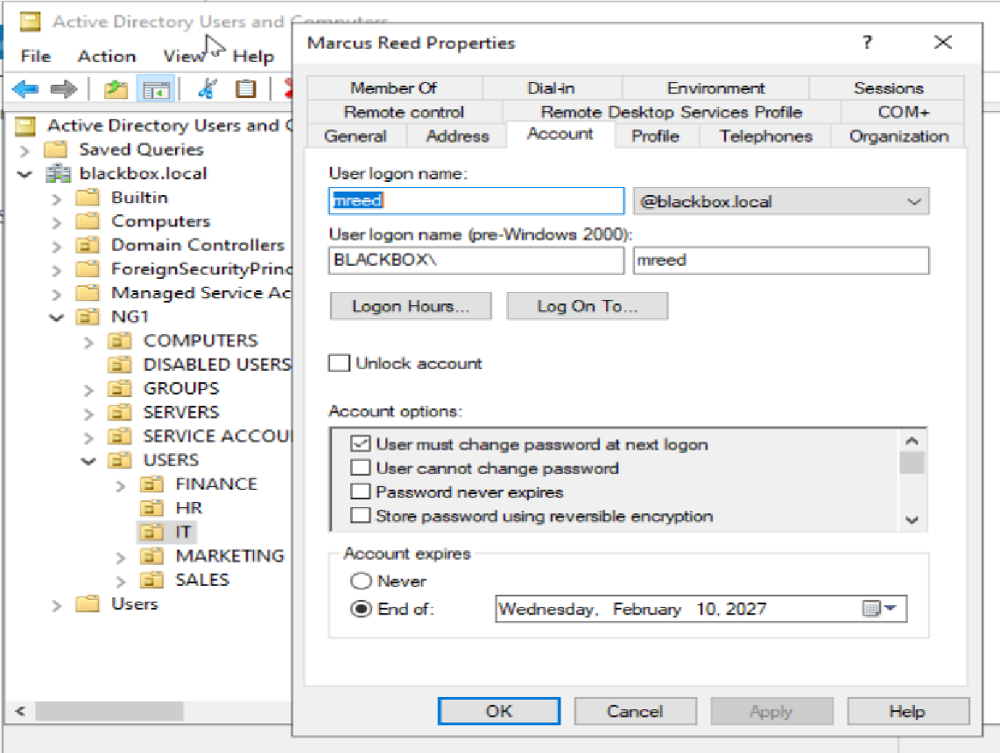
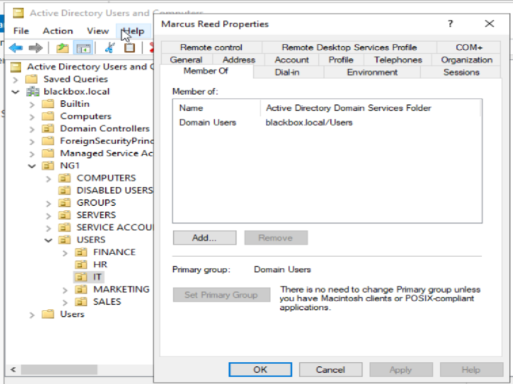
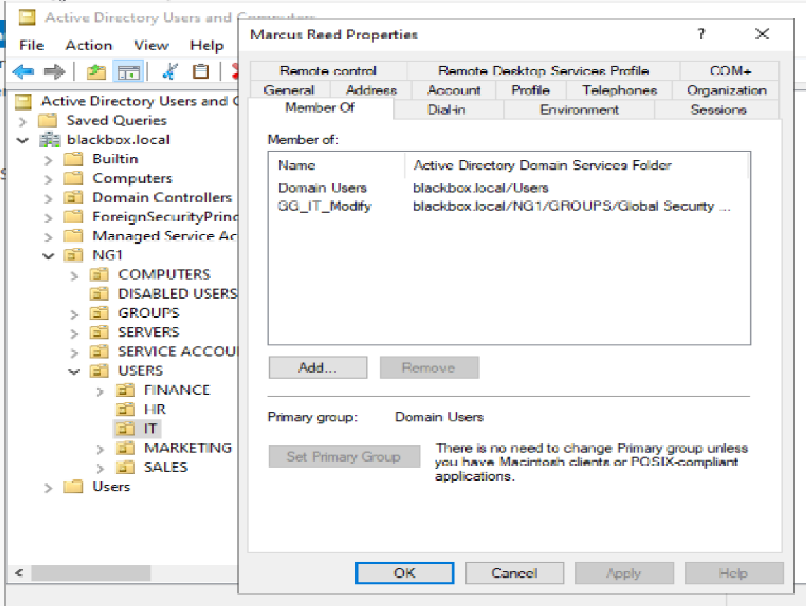

# HD-004 — Returning Contractor Account Provisioning

## Ticket Summary

| Field | Details |
|---|---|
| Ticket Number | HD-004 |
| Title | Returning Contractor Account Provisioning |
| User | Marcus Reed |
| Department | IT |
| Priority | High |
| Status | Resolved — server-side provisioning completed |
| Environment | Windows Server 2022, Active Directory Domain Services, Active Directory Users and Computers |

---

## User Description

An IT Manager submitted a request to restore access for Marcus Reed, a former employee returning to the company as an IT support contractor.

The original request indicated that Marcus's previous Active Directory account should still exist and may have been disabled during his original offboarding process.

The request also stated that Marcus required standard IT access for his new contractor role.

Before making any account changes, the existing Active Directory environment was reviewed to determine whether the old account still existed and whether its previous access remained appropriate.

---

## Environment and Background

The environment uses the internal Active Directory domain:

```text
blackbox.local
```

The IT Organizational Unit is located at:

```text
blackbox.local
└── NG1
    └── USERS
        └── IT
```

The environment also includes a dedicated location for disabled accounts:

```text
blackbox.local
└── NG1
    └── DISABLED USERS
```

Departmental file access is managed through Active Directory security groups.

Relevant IT groups include:

```text
GG_IT_Read
GG_IT_Modify
```

Marcus was returning under a six-month contractor agreement with an approved contract end date of:

```text
February 10, 2027
```

He required access to the IT departmental share but did not require administrative privileges or access to other departments.

---

## Initial Symptoms

This ticket was initially presented as an account reinstatement request.

The submitted request indicated:

- Marcus previously worked for the company.
- His old Active Directory account should still exist.
- The account may have been disabled during offboarding.
- He was returning as an IT support contractor.
- He required "standard IT access."

However, several details required verification before the account could safely be restored.

---

## Known Facts

Before making any changes, the following information was confirmed:

- Marcus Reed was returning as a contractor.
- His new role was IT Support Contractor.
- His contract duration was six months.
- His contract end date was February 10, 2027.
- He did not require Domain Admin or other administrative privileges.
- He did not require access to Finance, HR, Marketing, or Sales resources.
- His required IT departmental access level was not initially specified.
- Any existing account needed to be inspected before reactivation.

---

## Initial Investigation Plan

The initial plan was to:

1. Locate Marcus Reed's previous Active Directory account.
2. Check both the IT OU and disabled-user locations.
3. Determine whether the account was disabled, locked, or expired.
4. Review existing group memberships.
5. Identify any stale or excessive privileges.
6. Review the account expiration configuration.
7. Confirm whether the original account could safely be reused.
8. Clarify the required IT access level before granting permissions.
9. Reset the password and require a password change at next logon.
10. Configure an expiration date matching the contractor end date.
11. Verify the final account configuration.

---

## Investigation Process

### 1. Searched for the Existing Account

Active Directory Users and Computers was reviewed to locate Marcus Reed's previous account.

The IT Organizational Unit was inspected first.

No Marcus Reed account was found.

The `DISABLED USERS` Organizational Unit was then reviewed.

No Marcus Reed account was present there either.

This contradicted the original assumption that the account still existed in Active Directory.

---

### 2. Reclassified the Request

Because no previous account could be located, the ticket could no longer be treated as an account reactivation request.

The appropriate action became:

```text
Create a new contractor account
```

rather than:

```text
Re-enable an existing account
```

This prevented the technician from making assumptions based on the original ticket description.

---

### 3. Created the Contractor Account

A new Marcus Reed user account was created inside the IT Organizational Unit.

The account was configured with:

```text
User logon name: mreed
UPN: mreed@blackbox.local
Pre-Windows 2000 logon name: BLACKBOX\mreed
```

A temporary password was assigned.

The following option was enabled:

```text
User must change password at next logon
```

The account expiration date was configured to match the approved contract end date:

```text
February 10, 2027
```

This ensures that the account will automatically expire when the contractor engagement ends unless the agreement is extended.



---

### 4. Withheld Departmental Access Pending Clarification

At the time of account creation, the original request still described the required access as:

```text
standard IT access
```

This did not provide enough information to determine whether Marcus required:

```text
GG_IT_Read
```

or:

```text
GG_IT_Modify
```

Instead of assuming the correct access level, the account was initially left with only the default:

```text
Domain Users
```

membership.

This allowed the identity to be provisioned without prematurely granting departmental permissions.



---

### 5. Requested Authorization for IT Access

The IT Manager was asked to clarify whether Marcus required read-only or modify access to the IT departmental share.

The manager confirmed that Marcus needed to:

- Open files
- Create files
- Edit files
- Delete files

The manager also confirmed that Marcus did not require:

- Domain administrative privileges
- Server administrative access
- Access to other departmental shares

This authorization justified membership in:

```text
GG_IT_Modify
```

---

### 6. Assigned the Approved IT Group

After receiving clarification, Marcus was added to:

```text
GG_IT_Modify
```

His final group membership included:

```text
Domain Users
GG_IT_Modify
```

No unnecessary administrative or cross-department groups were assigned.



---

## Evidence Collected

The investigation and provisioning process produced the following evidence:

| Evidence | Result |
|---|---|
| Previous Marcus Reed account | Not found |
| IT OU search | No existing Marcus Reed account |
| Disabled Users OU search | No existing Marcus Reed account |
| New username | `mreed` |
| Account status | Enabled |
| Password handling | Temporary password assigned |
| Password change requirement | Enabled for next logon |
| Account expiration | February 10, 2027 |
| Initial departmental access | None |
| Initial group membership | `Domain Users` |
| Approved IT access | `GG_IT_Modify` |
| Privileged/admin groups | None assigned |
| Other departmental access | None assigned |

---

## Findings

The review established that:

- The original ticket description was inaccurate because no previous Marcus Reed account existed in Active Directory.
- A new user account was therefore required.
- Marcus was returning as a contractor rather than a permanent employee.
- The account needed a defined expiration date.
- The original request did not clearly define the required access level.
- Departmental permissions were appropriately withheld until authorization was received.
- The approved role required IT Modify access.
- No administrative privileges were necessary.
- No access to unrelated departmental resources was required.

---

## Root Cause

This ticket did not involve a technical failure.

The primary issue was inaccurate and incomplete information in the original request.

The request assumed that:

```text
Marcus Reed's old account still existed
```

but Active Directory verification showed that no such account was present.

The request also used the phrase:

```text
standard IT access
```

without identifying whether read-only or modify access was required.

Both assumptions required validation before proceeding.

---

## Resolution

The request was resolved using the following process:

1. Searched Active Directory for an existing Marcus Reed account.
2. Confirmed that no account existed in the IT OU.
3. Confirmed that no account existed in the Disabled Users OU.
4. Reclassified the ticket from account reinstatement to new contractor provisioning.
5. Created Marcus Reed inside the IT OU.
6. Assigned the username:

```text
mreed
```

7. Assigned a temporary password.
8. Enabled:

```text
User must change password at next logon
```

9. Set the account expiration date to:

```text
February 10, 2027
```

10. Initially left the account with only:

```text
Domain Users
```

11. Requested clarification for the required IT access level.
12. Received approval for create, edit, and delete access to the IT departmental share.
13. Added Marcus to:

```text
GG_IT_Modify
```

14. Confirmed that no administrative or unrelated departmental groups were assigned.

---

## Verification

Server-side verification confirmed:

- Marcus Reed exists in the IT Organizational Unit.
- The account is enabled.
- The username is `mreed`.
- The user must change the temporary password at next logon.
- The account expires on February 10, 2027.
- Marcus is a member of `GG_IT_Modify`.
- Marcus is not a member of any privileged administrative groups.
- Marcus does not have access groups for Finance, HR, Marketing, or Sales.

The final account configuration matches the approved contractor requirements.

---

## Verification Limitations

A full interactive user sign-in test could not be completed because the lab does not currently have a functioning domain-joined Windows workstation available for Marcus.

The following could therefore not be directly tested from an end-user workstation:

- First interactive logon
- Forced password change
- IT departmental share access
- File creation
- File modification
- File deletion
- Automatic account expiration behavior at the end of the contract

In a production environment, final verification would include the contractor signing in from the assigned workstation and confirming access to required IT resources.

---

## Final Result

Marcus Reed was successfully provisioned as an IT support contractor.

Final account configuration:

```text
Name: Marcus Reed
Username: mreed
Domain: blackbox.local
Department: IT
Role: IT Support Contractor
Account expiration: February 10, 2027
Password change at next logon: Required
Department access: GG_IT_Modify
Administrative privileges: None
Other departmental access: None
```

The account was provisioned according to least-privilege principles and configured to expire automatically at the end of the approved contract period.

Server-side provisioning was completed successfully.

---

## Lessons Learned

### Ticket descriptions should be verified against the environment

The original request stated that Marcus's previous account should still exist.

Active Directory showed otherwise.

A technician should treat ticket information as a starting point rather than unquestioned fact.

### Returning employees do not automatically receive their previous access

Even if Marcus's old account had existed, simply re-enabling it would not have been appropriate without reviewing:

- Current role
- Current access needs
- Previous group memberships
- Privileged access
- Contract status
- Account expiration

Old permissions may no longer reflect current responsibilities.

### Contractor accounts should have defined expiration dates

Unlike permanent employees, contractors typically have a known engagement period.

Marcus's account was configured to expire on:

```text
February 10, 2027
```

This reduces the risk of dormant contractor accounts remaining active after the engagement ends.

### Access should not be guessed from job titles

Marcus worked in IT, but that did not automatically justify:

```text
GG_IT_Modify
```

or any administrative group.

His actual work requirements were clarified before the access was granted.

### Identity provisioning and access authorization are separate decisions

Marcus's account could safely be created before the exact departmental permissions were known.

The account initially remained with only:

```text
Domain Users
```

until authorization was received.

This separation prevented unnecessary access from being granted.

### Privileged access requires explicit justification

Working in the IT department does not automatically justify:

- Domain Admin
- Server administration
- Local administrator
- Elevated infrastructure permissions

Marcus received only the access required to perform his approved contractor duties.

### Least privilege applies to contractors just as much as employees

Marcus needed access to the IT departmental share, but he did not need access to:

- Finance
- HR
- Marketing
- Sales
- Domain administration

Only the required IT Modify group was assigned.

---

## Administrator Reflection

This ticket reinforced the importance of verifying the actual environment before acting on a request.

The original assumption was that Marcus had an old disabled account that could be restored.

Instead of immediately looking for an Enable Account option and proceeding, I checked the IT OU and Disabled Users OU first.

When no account was found, the situation changed completely.

The workflow became:

```text
Receive reinstatement request
        ↓
Search Active Directory
        ↓
No existing account found
        ↓
Reclassify as new contractor provisioning
        ↓
Create identity
        ↓
Apply contract expiration
        ↓
Hold departmental access
        ↓
Request authorization
        ↓
Assign approved security group
        ↓
Verify final configuration
```

The second important decision was not assuming what "standard IT access" meant.

Because the account could be safely created without assigning departmental access, I left Marcus with only the default `Domain Users` membership until the IT Manager confirmed the required permissions.

Once it was confirmed that Marcus needed to create, edit, and delete files, `GG_IT_Modify` was assigned.

This ticket demonstrated that good account administration is not simply about knowing how to create or enable users in Active Directory.

It requires validating requests, separating identity creation from access authorization, accounting for employment type, controlling privilege, and making sure access reflects the user's current responsibilities rather than assumptions about their previous role.
