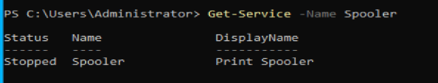
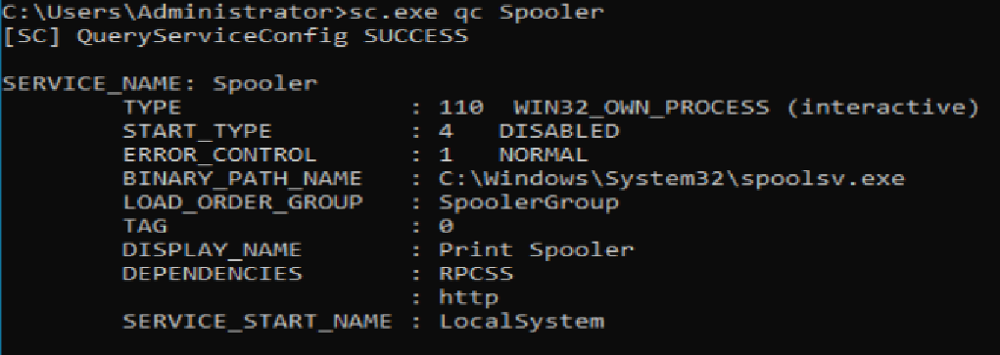
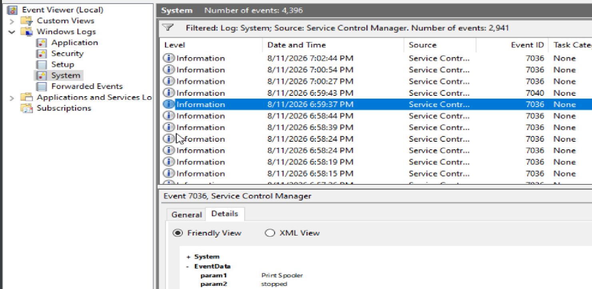
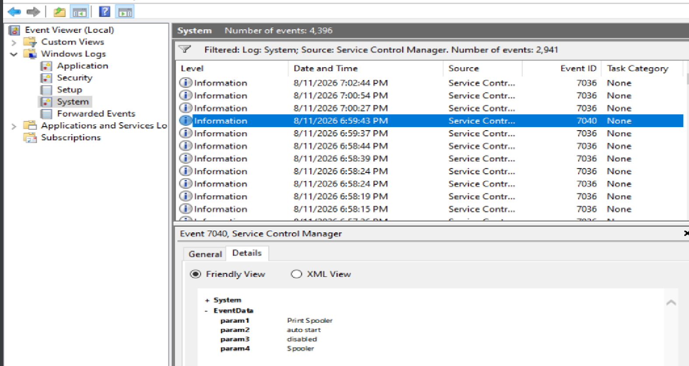
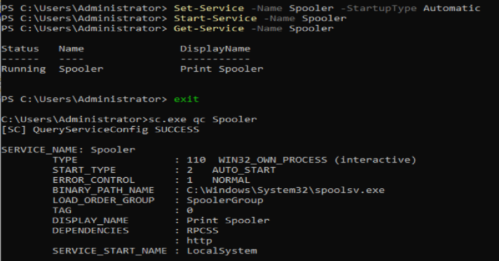
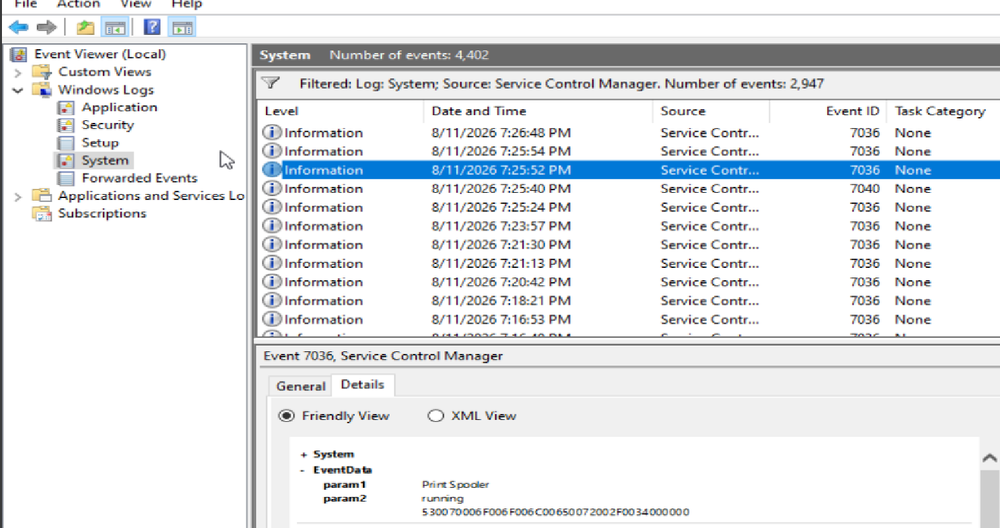
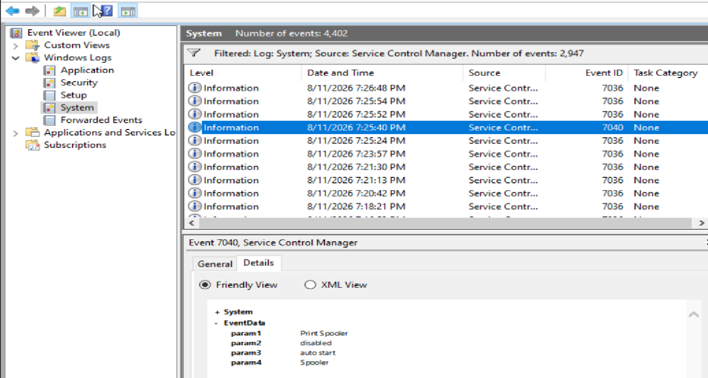

# HD-005 — Printing Suddenly Stopped Working

## Ticket Summary

| Field | Details |
|---|---|
| Ticket Number | HD-005 |
| Title | Printing Suddenly Stopped Working |
| User | Multiple Users |
| Department | Operations |
| Priority | Medium |
| Status | Resolved — server-side service restored |
| Environment | Windows Server 2022, Windows Services, PowerShell, Command Prompt, Event Viewer |

---

## User Description

Multiple users reported that printing had suddenly stopped working.

Users indicated that printers that had previously been available were no longer functioning normally and that print jobs were not completing.

The issue appeared to affect more than one user, which suggested that the problem could involve shared infrastructure rather than a single workstation.

The reported issue was:

> Printing was working previously, but users are now unable to print and some printers appear unavailable.

Because multiple users were affected, the investigation focused on determining whether a shared Windows printing component had failed or been misconfigured.

---

## Environment and Background

The affected environment uses:

```text
Windows Server 2022
```

Windows printing relies on the **Print Spooler** service, which manages print jobs and communication between Windows applications and configured printers.

Relevant service information:

```text
Service Name: Spooler
Display Name: Print Spooler
Executable: C:\Windows\System32\spoolsv.exe
```

The investigation used:

- PowerShell
- Command Prompt
- Windows Services
- Event Viewer
- Service Control Manager logs

The objective was to determine whether the printing issue was caused by:

- A stopped Windows service
- An incorrect service startup configuration
- A service crash
- A dependency failure
- Printer or driver configuration
- Another server-side issue

---

## Initial Symptoms

The initial symptoms were:

- Multiple users were reportedly unable to print.
- Printing had previously worked.
- Some printers appeared unavailable.
- The issue was not isolated to one user.
- No intentional configuration change had been reported.
- The exact cause was unknown.

Because the issue affected multiple users, troubleshooting needed to determine whether the failure existed on individual endpoints or within shared printing infrastructure.

---

## Known Facts

At the beginning of the investigation:

- Printing previously worked.
- More than one user was reportedly affected.
- No known intentional change had been reported.
- The Print Spooler service was a likely shared component worth investigating.
- No evidence had yet established whether the problem involved the service, printer connectivity, drivers, or permissions.
- Restarting or changing services without first collecting evidence could remove useful troubleshooting context.

---

## Initial Investigation Plan

The troubleshooting plan was:

1. Determine whether the issue affected one user or multiple users.
2. Identify the Windows component responsible for print processing.
3. Check the current Print Spooler service state.
4. Inspect the Print Spooler startup configuration.
5. Review Event Viewer for service-related events.
6. Determine whether the service stopped normally, crashed, or was reconfigured.
7. Check for evidence of dependency failures.
8. Apply the smallest justified configuration change.
9. Start the service.
10. Verify the service state and startup configuration.
11. Review Event Viewer again to confirm the restored state.
12. Document any limitations in end-user verification.

---

## Investigation Process

### 1. Checked the Print Spooler Service State

PowerShell was used to determine the current state of the Print Spooler service:

```powershell
Get-Service -Name Spooler
```

The result showed:

```text
Status   Name      DisplayName
------   ----      -----------
Stopped  Spooler   Print Spooler
```

This confirmed that the Windows Print Spooler service was not running.



At this stage, the service was not immediately restarted because the reason it stopped had not yet been established.

---

### 2. Checked the Service Configuration

The Print Spooler configuration was examined using:

```cmd
sc.exe qc Spooler
```

The output showed:

```text
SERVICE_NAME: Spooler

START_TYPE         : 4   DISABLED
BINARY_PATH_NAME   : C:\Windows\System32\spoolsv.exe
DISPLAY_NAME       : Print Spooler
DEPENDENCIES       : RPCSS
                     http
SERVICE_START_NAME : LocalSystem
```

The important finding was:

```text
START_TYPE : 4 DISABLED
```

The service had not simply stopped.

Its startup configuration had been changed to **Disabled**, which prevented Windows from starting the service normally.



---

### 3. Reviewed Service Control Manager Events

Event Viewer was opened and the following log was reviewed:

```text
Event Viewer
└── Windows Logs
    └── System
```

The log was filtered for:

```text
Service Control Manager
```

This allowed service state and configuration changes to be reviewed without manually searching through unrelated System events.

---

### 4. Identified the Print Spooler Stop Event

A relevant **Event ID 7036** was identified.

The event showed that the:

```text
Print Spooler
```

service entered the:

```text
stopped
```

state.

This confirmed that Windows had recorded the service transition.



---

### 5. Identified the Startup Configuration Change

A highly relevant **Event ID 7040** was also identified.

The event showed that the Print Spooler startup type had changed from:

```text
auto start
```

to:

```text
disabled
```

This provided historical evidence that the service configuration had been changed.



The evidence now supported the following sequence:

```text
Printing previously functioning
        ↓
Print Spooler startup type changed
Automatic → Disabled
        ↓
Print Spooler entered stopped state
        ↓
Printing functionality became unavailable
```

This was stronger evidence than simply observing that the service was currently stopped.

---

## Evidence Collected

| Evidence | Result |
|---|---|
| `Get-Service -Name Spooler` | Print Spooler was stopped |
| `sc.exe qc Spooler` | Startup type was Disabled |
| Service executable | `C:\Windows\System32\spoolsv.exe` |
| Service account | LocalSystem |
| Dependencies | RPCSS and HTTP |
| Event ID 7036 | Print Spooler entered stopped state |
| Event ID 7040 | Startup type changed from Automatic to Disabled |
| Evidence of service crash | Not identified |
| Evidence of dependency failure | Not identified |
| Evidence identifying who changed configuration | Not established |

---

## Findings

The investigation established that:

- The Print Spooler service was stopped.
- The service startup type had been configured as Disabled.
- The disabled startup configuration prevented normal service operation.
- Event Viewer confirmed that the startup type had previously changed from Automatic to Disabled.
- Event Viewer also confirmed that the Print Spooler entered the stopped state.
- No evidence collected during this investigation showed that the service had crashed.
- No dependency failure was identified.
- The available evidence established that a configuration change occurred but did not establish who made the change.

The investigation therefore supported a service configuration issue rather than a printer-specific or individual-user failure.

---

## Root Cause

The Print Spooler service had been configured with the startup type:

```text
Disabled
```

and the service was stopped.

Because Windows printing depends on the Print Spooler service, disabling and stopping the service prevented normal print processing.

Event ID 7040 provided historical evidence that the service configuration changed from:

```text
Automatic
```

to:

```text
Disabled
```

The evidence supports the configuration change as the cause of the service outage.

The investigation did **not** establish who or what initiated the configuration change.

---

## Resolution

The smallest justified change was to restore the Print Spooler to its previous automatic startup configuration and start the service.

PowerShell was used:

```powershell
Set-Service -Name Spooler -StartupType Automatic
Start-Service -Name Spooler
```

The service state was then verified:

```powershell
Get-Service -Name Spooler
```

The resulting state was:

```text
Status   Name      DisplayName
------   ----      -----------
Running  Spooler   Print Spooler
```

The startup configuration was also verified using:

```cmd
sc.exe qc Spooler
```

The result showed:

```text
START_TYPE : 2 AUTO_START
```

This confirmed that:

- The Print Spooler was running.
- The service startup configuration had been restored to Automatic.



---

## Post-Resolution Event Verification

### Event ID 7036 — Service Running

Event Viewer was reviewed again after the service was started.

A new **Event ID 7036** confirmed that the:

```text
Print Spooler
```

service entered the:

```text
running
```

state.



---

### Event ID 7040 — Startup Type Restored

A new **Event ID 7040** also confirmed that the Print Spooler startup type changed from:

```text
disabled
```

to:

```text
auto start
```



The complete service-state timeline was therefore:

```text
Print Spooler configured as Automatic
        ↓
Startup type changed to Disabled
        ↓
Service entered Stopped state
        ↓
Printing issue reported
        ↓
Service configuration investigated
        ↓
Startup type restored to Automatic
        ↓
Service started
        ↓
Service entered Running state
```

---

## Verification

Server-side verification confirmed:

- The Print Spooler service is running.
- The Print Spooler startup type is Automatic.
- `Get-Service` reports the service as Running.
- `sc.exe qc Spooler` reports `AUTO_START`.
- Event ID 7036 confirms the service entered the running state.
- Event ID 7040 confirms the startup configuration was restored from Disabled to Automatic.
- No additional service configuration change was required.

The Windows service configuration was successfully restored.

---

## Verification Limitations

The lab does not currently include a functioning domain-joined workstation and physical or network printer configuration that can be used for complete end-user print testing.

Because of this, the following could not be directly verified:

- A user submitting a new print job
- A print job entering the queue
- A physical printer receiving the job
- Successful printed output
- User confirmation that printing functionality was restored

The resolution is therefore verified at the **Windows service and event-log level**, but not through an actual end-user print transaction.

In a production environment, final verification would include:

1. Asking an affected user to submit a test print.
2. Confirming the job enters and exits the print queue.
3. Confirming the printer receives the job.
4. Confirming the expected document prints successfully.
5. Monitoring the Print Spooler for additional failures.

---

## Final Result

The Print Spooler service was found stopped and configured with a Disabled startup type.

Event Viewer showed that the service startup configuration had changed from Automatic to Disabled before the service entered the stopped state.

The service was restored using:

```powershell
Set-Service -Name Spooler -StartupType Automatic
Start-Service -Name Spooler
```

Final configuration:

```text
Service: Print Spooler
Service Name: Spooler
Status: Running
Startup Type: Automatic
Executable: C:\Windows\System32\spoolsv.exe
Service Account: LocalSystem
```

Server-side service functionality was restored successfully.

---

## Lessons Learned

### Multiple affected users can indicate a shared infrastructure problem

A single user being unable to print could point toward:

- A workstation issue
- A local driver
- User configuration
- A disconnected printer
- Local permissions

Multiple users experiencing the same problem increases the likelihood that a shared component should be investigated.

This does not eliminate endpoint troubleshooting, but it changes the scope and priority of the investigation.

---

### A stopped service is a symptom, not automatically the root cause

Finding:

```text
Print Spooler = Stopped
```

does not answer why printing failed.

The service could have:

- Crashed
- Been manually stopped
- Been disabled
- Failed because of a dependency
- Failed during startup
- Been changed through policy or administration

Checking the configuration and logs provided the context needed to identify the actual problem.

---

### Do not immediately restart a failed service

Restarting a service may restore functionality, but doing so before investigating can remove valuable troubleshooting context.

Before making a change, I checked:

```powershell
Get-Service -Name Spooler
```

and:

```cmd
sc.exe qc Spooler
```

and then reviewed Event Viewer.

This showed that the service was not merely stopped — it had been explicitly configured as Disabled.

---

### Event Viewer can establish a timeline

Event ID 7036 showed service-state transitions.

Event ID 7040 showed startup configuration changes.

Together, they provided a timeline that explained what happened before the outage.

This was more useful than relying only on the service's current state.

---

### Configuration evidence and attribution are different

Event ID 7040 established that the Print Spooler startup configuration changed.

It did not establish who made that change.

The correct conclusion is:

```text
The startup configuration was changed.
```

not:

```text
A specific administrator changed the configuration.
```

Attribution would require additional evidence.

---

### Apply the smallest justified change

Once the evidence showed that the Print Spooler had previously been configured as Automatic and was now Disabled, the appropriate correction was limited to:

```text
Disabled → Automatic
Stopped → Running
```

No unrelated services, drivers, permissions, or printer settings were modified.

---

### Verification should include both state and configuration

Simply seeing the service running would not fully verify the fix.

The investigation verified both:

```text
Service state: Running
Startup type: Automatic
```

This reduces the chance that the service works temporarily but fails again after reboot because the startup configuration remains incorrect.

---

### Verification limitations should be documented

The server-side configuration was successfully restored, but a real print job could not be tested in the current lab.

Documenting this distinction avoids claiming evidence that was never collected.

In production, user confirmation and a successful print job would be required before fully closing the incident.

---

## Administrator Reflection

My initial instinct was to start with an affected user's workstation because the server environment could contain many different systems and services.

I would first want to determine whether the user received a useful error message and whether the printer appeared connected or reachable.

However, the fact that multiple users were reportedly affected changed the scope of the investigation.

Once a shared printing issue became likely, the Windows Print Spooler became an important component to check.

Rather than immediately restarting it, I first collected evidence.

The initial command:

```powershell
Get-Service -Name Spooler
```

showed that the service was stopped.

That alone did not explain why.

Checking the service configuration with:

```cmd
sc.exe qc Spooler
```

showed that the startup type was Disabled.

I then reviewed the System log in Event Viewer to determine whether anything happened around the time the service stopped.

Event ID 7040 showed that the Print Spooler startup type changed from Automatic to Disabled, while Event ID 7036 confirmed that the service entered the stopped state.

The troubleshooting workflow became:

```text
Multiple users report printing failure
        ↓
Consider shared infrastructure
        ↓
Check Print Spooler state
        ↓
Service found Stopped
        ↓
Check service configuration
        ↓
Startup type found Disabled
        ↓
Review Event Viewer
        ↓
7040 confirms Automatic → Disabled
        ↓
7036 confirms service stopped
        ↓
Restore startup type to Automatic
        ↓
Start Print Spooler
        ↓
Verify Running state
        ↓
Verify AUTO_START configuration
        ↓
Confirm restoration through Event Viewer
```

The biggest lesson from this ticket was that restarting a service and troubleshooting a service are not the same thing.

If I had immediately clicked **Start**, I might have restored functionality temporarily without understanding the configuration problem behind the outage.

Instead, checking the current state, configuration, and historical events allowed the change to be evidence-based.

This ticket also reinforced the importance of separating what the evidence proves from what it does not.

The logs showed that the service configuration changed, but they did not identify the person or process responsible for making the change.

In a production environment, I would finish the incident by having an affected user submit a test print, confirming successful output, monitoring the service for recurrence, and escalating further if the startup configuration changed unexpectedly again.
