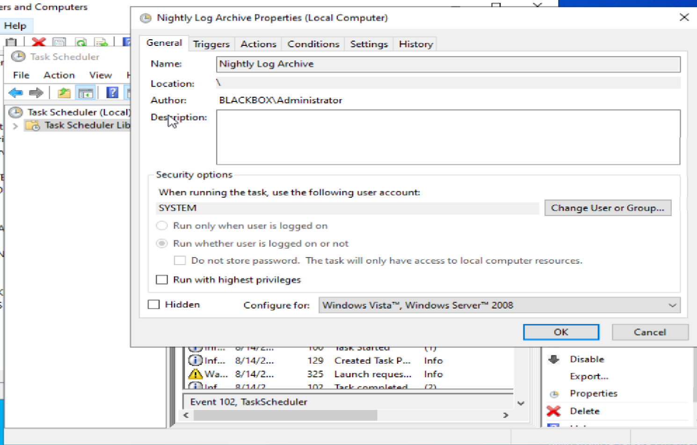
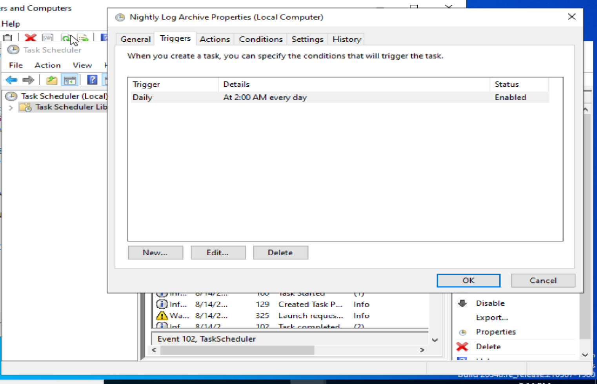
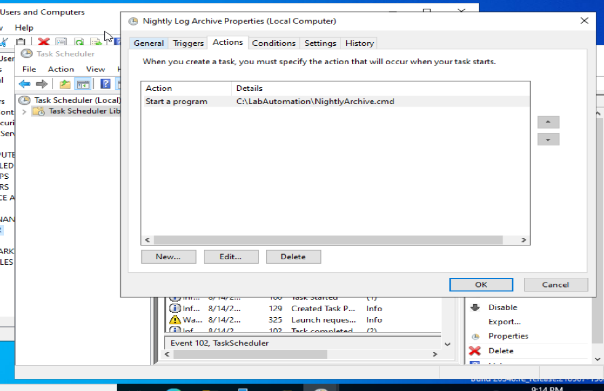
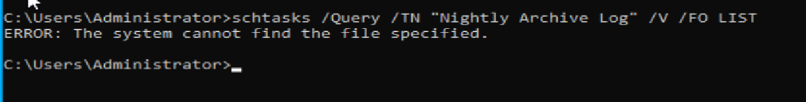
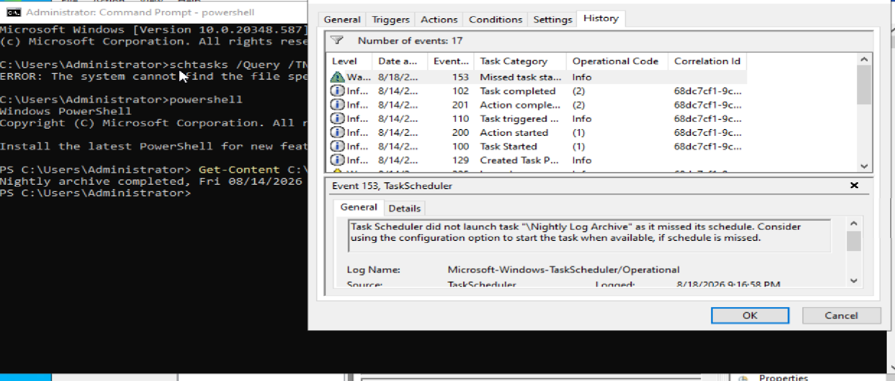
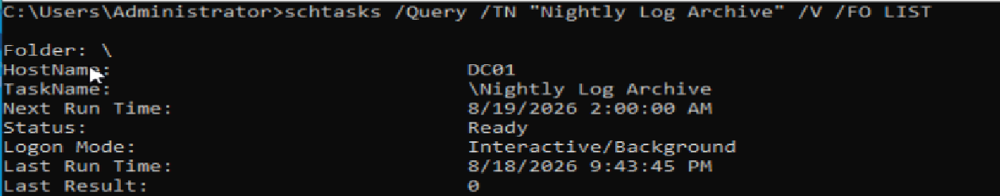
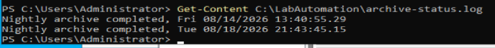

# HD-006 — Nightly Automated Task No Longer Completing

## Ticket Summary

| Field           | Details                                                         |
| --------------- | --------------------------------------------------------------- |
| Ticket Number   | HD-006                                                          |
| Title           | Nightly Automated Task No Longer Completing                     |
| Submitted By    | Operations Team                                                 |
| Priority        | Medium                                                          |
| Status          | Resolved                                                        |
| Affected System | DC01                                                            |
| Environment     | Windows Server 2022, Task Scheduler, PowerShell, Command Prompt |

---

## User Description

The Operations team reported that a nightly automated log archive process was no longer completing.

The scheduled process normally runs automatically each night and writes a successful completion entry to a status log.

Operations noticed that the expected status file had stopped receiving new completion entries.

The reported issue was:

> Our nightly log archive process doesn't appear to be completing anymore. The process normally runs automatically each night and updates an archive status log. The status file has not received a new completion entry since the last successful run.

Because the process was automated, the investigation needed to distinguish between:

* The task failing to trigger
* Task Scheduler failing
* The configured action failing to launch
* The underlying script failing
* The execution account lacking permissions
* The expected output failing to generate

---

## Environment and Background

The affected scheduled task was located on:

```text
DC01
```

The task was named:

```text
Nightly Log Archive
```

The expected automation path was:

```text
C:\LabAutomation\NightlyArchive.cmd
```

The expected output file was:

```text
C:\LabAutomation\archive-status.log
```

The task was configured to:

* Run daily
* Trigger at 2:00 AM
* Run as the `SYSTEM` account
* Launch the `NightlyArchive.cmd` script
* Write a completion timestamp to `archive-status.log`

The investigation used:

* Windows Task Scheduler
* `schtasks`
* PowerShell
* File-system validation
* Task Scheduler operational history

---

## Initial Symptoms

The initial symptoms were:

* The automation had previously completed successfully.
* The expected archive status log was no longer receiving new completion entries.
* Operations reported no intentional change to the task schedule.
* The task still existed in Task Scheduler.
* The exact failure point was unknown.

The main troubleshooting question became:

```text
Is the scheduler failing,
or is the action being scheduled failing?
```

---

## Known Facts

At the start of the investigation:

* The process had a known previous successful execution.
* The expected output was a timestamp written to `archive-status.log`.
* The task was supposed to run automatically each day.
* The affected system was DC01.
* The task configuration had not yet been verified.
* A scheduled task reporting that it ran would not automatically prove that the underlying script completed successfully.

The investigation therefore needed to validate the entire chain:

```text
Trigger
   ↓
Task starts
   ↓
Action launches
   ↓
Script executes
   ↓
Expected output is produced
```

---

## Initial Investigation Plan

The troubleshooting plan was to:

1. Confirm which server hosted the scheduled task.
2. Review the last known successful output.
3. Inspect the scheduled task configuration.
4. Confirm the task was enabled.
5. Review the configured trigger.
6. Identify the exact executable or script path configured in the task action.
7. Verify the account used to run the task.
8. Query the task from the command line.
9. Inspect Task Scheduler history around previous and failed executions.
10. Verify whether the configured target file existed.
11. Make the smallest justified correction.
12. Manually trigger the repaired task.
13. Verify both Task Scheduler success and expected business output.

---

## Investigation Process

### 1. Reviewed the Task Security Context

The **General** tab of the scheduled task was reviewed first.

The task was configured to run using:

```text
SYSTEM
```

This showed that the task did not depend on an interactive user session or an individual employee account.

No change to the execution account was justified at this stage.



---

### 2. Verified the Scheduled Trigger

The **Triggers** tab showed:

```text
Daily
At 2:00 AM every day
Status: Enabled
```

This established that the task still had an active daily trigger.

There was no evidence that the schedule itself had been deleted or disabled.



---

### 3. Verified the Configured Action

The **Actions** tab was reviewed to determine exactly what Task Scheduler was expected to launch.

The configured action was:

```text
Start a program
C:\LabAutomation\NightlyArchive.cmd
```

This was an important finding because it identified the specific dependency that needed to exist for the automation to work.



---

### 4. Corrected an Initial Command-Line Query Error

During the investigation, an initial `schtasks` query used the incorrect task name:

```cmd
schtasks /Query /TN "Nightly Archive Log" /V /FO LIST
```

This returned:

```text
ERROR: The system cannot find the file specified.
```

The result was recognized as an investigator command-input error rather than evidence of the incident.

The actual scheduled task name was:

```text
Nightly Log Archive
```

The command was corrected before continuing the investigation.



This result was **not** used to determine the root cause.

---

### 5. Verified the Configured Script Path

After identifying the configured action path, PowerShell was used to verify whether the expected script existed:

```powershell
Test-Path "C:\LabAutomation\NightlyArchive.cmd"
```

The result was:

```text
False
```

This established that Task Scheduler was configured to execute a file that did not currently exist at the expected location.


Further inspection of the automation directory showed that a similarly named file existed as:

```text
NightlyArchive.cmd.bak
```

while the expected:

```text
NightlyArchive.cmd
```

was missing.

At this point, the investigation had identified a likely action-level failure rather than a Task Scheduler service failure.

---

### 6. Reviewed Task Scheduler History

Task Scheduler history was reviewed for additional context.

A separate **Event ID 153** was identified indicating that the scheduled task had previously missed a scheduled start.

The event stated that Task Scheduler did not launch the task because its scheduled execution was missed.



This was documented as a separate observation.

It did **not** explain why the task's configured action could not complete when manually triggered.

The investigation therefore kept two findings separate:

```text
Finding 1:
A scheduled 2:00 AM execution was missed.

Finding 2:
The configured action pointed to a script that did not exist.
```

The missing script path was the finding directly related to the failed automation being investigated.

---

## Evidence Collected Before Resolution

The investigation established:

| Evidence                                       | Result                                |
| ---------------------------------------------- | ------------------------------------- |
| Task exists                                    | Yes                                   |
| Task enabled                                   | Yes                                   |
| Run as account                                 | `SYSTEM`                              |
| Trigger                                        | Daily at 2:00 AM                      |
| Trigger enabled                                | Yes                                   |
| Configured action                              | `C:\LabAutomation\NightlyArchive.cmd` |
| Expected output                                | `C:\LabAutomation\archive-status.log` |
| Expected script path exists                    | No                                    |
| `Test-Path` result                             | `False`                               |
| Alternate file present                         | `NightlyArchive.cmd.bak`              |
| Missed schedule event                          | Event ID 153 observed                 |
| Evidence Task Scheduler itself was unavailable | Not identified                        |

---

## Findings

The investigation established that the scheduled task configuration itself was largely intact.

The task:

* Existed
* Was enabled
* Had an enabled daily trigger
* Ran as `SYSTEM`
* Still pointed to the expected automation location

The failure occurred at the **action dependency level**.

Task Scheduler expected:

```text
C:\LabAutomation\NightlyArchive.cmd
```

but that file was no longer present under that name.

Instead, the automation directory contained:

```text
NightlyArchive.cmd.bak
```

Because Task Scheduler was still configured to launch the `.cmd` file, the scheduled process could not execute the expected script.

---

## Root Cause

The root cause was a mismatch between the scheduled task's configured action and the actual file present on disk.

Task Scheduler was configured to execute:

```text
C:\LabAutomation\NightlyArchive.cmd
```

However, the script existed as:

```text
C:\LabAutomation\NightlyArchive.cmd.bak
```

The expected `.cmd` path therefore returned:

```text
False
```

when tested.

The task configuration itself did not need to be recreated or replaced.

The underlying file simply needed to be restored to the path expected by the task.

---

## Resolution

The smallest justified correction was to restore the script to its expected filename.

PowerShell was used:

```powershell
Rename-Item "C:\LabAutomation\NightlyArchive.cmd.bak" "NightlyArchive.cmd"
```

The expected path was then validated:

```powershell
Test-Path "C:\LabAutomation\NightlyArchive.cmd"
```

The result was:

```text
True
```


No changes were made to:

* The scheduled trigger
* The execution account
* Task Scheduler service configuration
* The script contents
* The task name

Only the missing dependency was restored.

---

## Post-Resolution Verification

### 1. Manually Triggered the Task

The repaired automation was manually executed using:

```cmd
schtasks /Run /TN "Nightly Log Archive"
```

This allowed the repaired task to be tested immediately rather than waiting until the next scheduled 2:00 AM execution.

---

### 2. Verified Task Scheduler Result

The task was queried again:

```cmd
schtasks /Query /TN "Nightly Log Archive" /V /FO LIST
```

The result showed:

```text
Status: Ready
Last Run Time: 8/18/2026 9:43:45 PM
Last Result: 0
```

A result of:

```text
0
```

confirmed that Task Scheduler considered the latest execution successful.



---

### 3. Verified Expected Automation Output

Task Scheduler success alone was not treated as sufficient verification.

The expected status log was checked using:

```powershell
Get-Content C:\LabAutomation\archive-status.log
```

The log contained the previous successful entry:

```text
Nightly archive completed: Fri 08/14/2026 13:40:55.29
```

and a new entry from the repaired execution:

```text
Nightly archive completed: Tue 08/18/2026 21:43:45.15
```



This confirmed that the underlying automation actually completed and produced the expected output.

---

## Verification

Final verification confirmed:

* The scheduled task still exists.
* The task is enabled.
* The daily 2:00 AM trigger remains configured.
* The task runs as `SYSTEM`.
* The task still points to `C:\LabAutomation\NightlyArchive.cmd`.
* The expected script now exists.
* `Test-Path` returns `True`.
* The task can be manually triggered.
* `Last Result` returns `0`.
* The archive status log receives a new completion entry.

The complete verification chain was:

```text
Task configuration valid
        ↓
Action path identified
        ↓
Expected script missing
        ↓
Expected filename restored
        ↓
Path verification returned True
        ↓
Task manually executed
        ↓
Last Result = 0
        ↓
archive-status.log updated
        ↓
Automation verified successfully
```

---

## Verification Limitations

The automation was manually triggered after the repair and successfully produced the expected output.

This confirms that:

* Task Scheduler can launch the action.
* The script can execute.
* The expected output can be generated.

However, the next naturally scheduled **2:00 AM execution** had not yet occurred at the time the ticket was closed.

Therefore, the manual execution path was fully verified, while the next unattended scheduled execution remained pending.

In a production environment, the task could be monitored during the next scheduled window to confirm that the trigger also executes successfully without manual intervention.

---

## Separate Observation — Missed Scheduled Execution

Task Scheduler history contained:

```text
Event ID 153
```

indicating that the task had previously missed a scheduled start.

This was not treated as the root cause of the action failure.

The scheduled task also showed settings that did not automatically compensate for a missed scheduled run.

In a production environment, depending on business requirements, an administrator could evaluate enabling an option similar to:

```text
Run task as soon as possible after a scheduled start is missed
```

That would be a separate configuration decision and was not required to repair the missing script problem.

No unrelated task settings were changed during this ticket.

---

## Final Result

The nightly automated task was successfully restored.

Final state:

```text
System: DC01
Task: Nightly Log Archive
Run As: SYSTEM
Schedule: Daily at 2:00 AM
Task State: Enabled
Action: C:\LabAutomation\NightlyArchive.cmd
Script Path: Present
Manual Test Result: 0
Expected Output: Successfully generated
```

The failure was caused by the scheduled task pointing to a script that was no longer present under the expected filename.

Restoring the expected script path allowed the task to execute successfully without modifying unrelated scheduler settings.

---

## Lessons Learned

### A scheduled task and its action are separate troubleshooting layers

A task can:

```text
Exist
Be enabled
Have a valid trigger
```

while still failing because the action it is supposed to execute is unavailable.

The scheduler itself should not automatically be blamed when an automation fails.

---

### "Task triggered" does not mean "automation completed"

A scheduled process has multiple stages:

```text
Trigger fires
     ↓
Task starts
     ↓
Action starts
     ↓
Script executes
     ↓
Expected output occurs
```

Success at one stage does not prove success at the next.

This ticket reinforced the importance of validating the final expected result.

---

### Inspect the configured action directly

Rather than guessing which script the task should execute based on historical logs, the **Actions** tab provided the authoritative configured path:

```text
C:\LabAutomation\NightlyArchive.cmd
```

That gave the investigation a specific dependency to validate.

---

### Validate whether dependencies actually exist

Once the action path was known, the simple command:

```powershell
Test-Path "C:\LabAutomation\NightlyArchive.cmd"
```

returned:

```text
False
```

This was one of the most useful pieces of evidence in the investigation.

A configuration can look correct while still pointing to something that no longer exists.

---

### Separate tool errors from system errors

An early `schtasks` query used the wrong task name and returned an error.

Rather than treating that message as evidence of the incident, the command syntax and task name were rechecked.

This prevented an investigator-generated error from becoming part of the root-cause conclusion.

---

### Separate independent findings

Event ID 153 showed that the task had missed a scheduled execution.

The missing script path showed that the task's action could not execute correctly.

These were two different observations.

Troubleshooting should avoid combining unrelated evidence simply because it appears during the same investigation.

---

### Use the smallest justified fix

The task did not need to be:

* Deleted
* Recreated
* Moved
* Assigned a different account
* Given additional privileges
* Rescheduled

The only required correction was:

```text
NightlyArchive.cmd.bak
        ↓
NightlyArchive.cmd
```

This restored the dependency expected by the existing configuration.

---

### Verify business output, not only infrastructure status

A successful:

```text
Last Result: 0
```

was useful evidence.

But the stronger verification was:

```text
archive-status.log
```

receiving a new successful completion entry.

That proved the automation accomplished what it was designed to do.

---

### Last known good output can establish a troubleshooting timeline

The status log contained an earlier successful completion timestamp.

That provided a reference point for determining that the automation had previously worked and that the failure occurred afterward.

Logs generated by applications and scripts can therefore be just as important as Windows system logs.

---

## Administrator Reflection

This ticket reinforced the difference between troubleshooting a scheduler and troubleshooting the process being scheduled.

My initial approach was to determine:

* Where the automation was running
* What server hosted it
* Where the output was stored
* When it last completed successfully
* What Task Scheduler reported around the failure

I initially thought historical task information might be necessary to determine which script was being executed.

However, reviewing the **Actions** tab provided a more direct answer because it showed exactly what Task Scheduler was configured to launch:

```text
C:\LabAutomation\NightlyArchive.cmd
```

The troubleshooting workflow then became:

```text
Automation output stopped updating
        ↓
Inspect scheduled task
        ↓
Confirm task is enabled
        ↓
Confirm trigger is enabled
        ↓
Confirm execution account
        ↓
Inspect configured action
        ↓
Identify expected script path
        ↓
Test expected path
        ↓
Path does not exist
        ↓
Locate .bak version of script
        ↓
Restore expected filename
        ↓
Verify path exists
        ↓
Manually execute scheduled task
        ↓
Verify Last Result = 0
        ↓
Verify archive-status.log updated
```

One of the most important lessons was that I could not stop troubleshooting at:

```text
The task ran.
```

The actual question was whether the automation completed its intended job.

Checking the updated archive status log provided stronger verification than relying on Task Scheduler alone.

The investigation also reinforced the importance of not forcing every discovered event into one root cause.

Event ID 153 showed a missed scheduled start, but that did not explain why the configured script path was missing. Keeping those findings separate prevented an incorrect conclusion.

Finally, an early command-line query contained the wrong task name. Recognizing that the resulting error was caused by my own command rather than the system was another reminder to validate my tools and syntax before using their output as evidence.

In a production environment, I would continue monitoring the task through its next naturally scheduled 2:00 AM execution and confirm that the unattended trigger completes successfully. I would also review whether missed-run recovery should be enabled depending on the importance of the nightly archive process.
