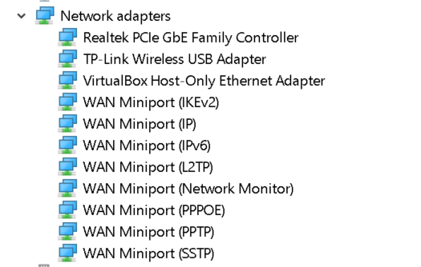
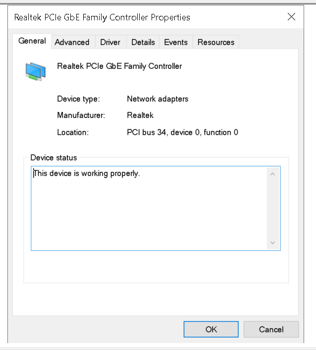
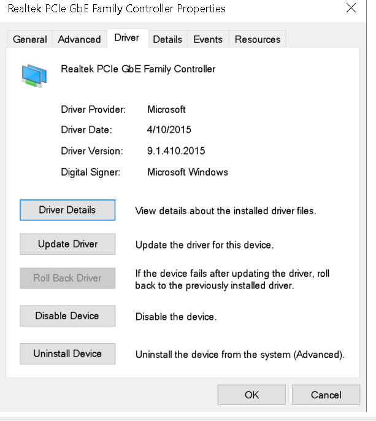
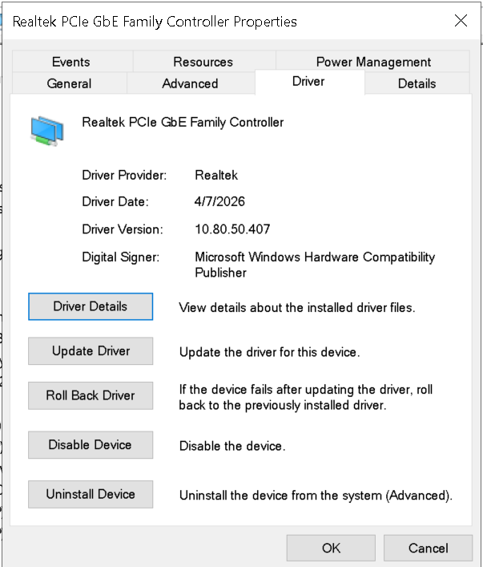
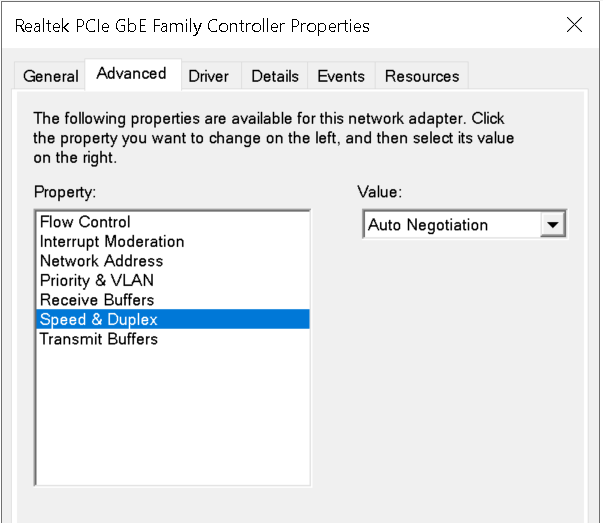
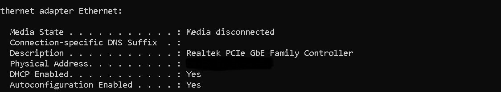
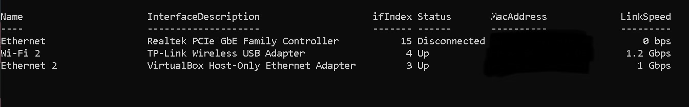

# HD-008 — Desktop Ethernet Adapter Shows No Physical Link

## Ticket Summary

A Windows 10 desktop could not establish a wired Ethernet connection.

The onboard Realtek PCIe GbE controller appeared normally in Windows Device Manager and reported that it was working properly. However, the adapter remained disconnected, showed a link speed of `0 bps`, and produced no link/activity lights when connected to the network.

Physical connections, router ports, adapter configuration, Windows system files, chipset drivers, and Ethernet drivers were tested before a likely physical-layer failure of the onboard Ethernet interface was identified.

---

## Ticket Information

| Field | Details |
|---|---|
| Ticket ID | HD-008 |
| Category | Hardware / Network Connectivity |
| Priority | Medium |
| Status | Replacement recommended |
| Operating System | Windows 10 Home |
| Motherboard | MSI B450 Tomahawk MAX |
| Network Adapter | Realtek PCIe GbE Family Controller |
| Temporary Connection | TP-Link USB Wireless Adapter |
| User Impact | Wired Ethernet unavailable; Wi-Fi remained operational |

---

## Reported Issue

The user reported that the desktop could no longer establish a wired connection to the home network.

The following symptoms were observed:

- No Ethernet connectivity
- No link or activity LEDs on the desktop Ethernet port
- No link or activity LEDs on the corresponding router port
- Ethernet adapter displayed as disconnected
- Link speed displayed as `0 bps`
- Wi-Fi connectivity continued to function normally

---

## Initial Assessment

Because Wi-Fi remained operational, the wider internet connection and basic router functionality were likely working.

The investigation focused on the wired connection path:

```text
Router LAN Port
      ↓
Ethernet Cable
      ↓
Motherboard RJ45 Port
      ↓
Ethernet PHY / Controller
      ↓
Windows Driver
      ↓
Operating System
```

---

## Troubleshooting Process

### 1. Verified the physical connection

The following physical-layer tests were completed:

- Replaced the existing cable with a new Cat6a Ethernet cable
- Tested multiple LAN ports on the router
- Confirmed that the cable connector clicked securely into place
- Inspected the RJ45 port and contact pins for visible damage
- Checked both ends of the connection for link/activity LEDs

**Result:** No physical link lights appeared on either device.

---

### 2. Confirmed that Windows detected the adapter

Device Manager showed the Realtek PCIe GbE Family Controller under Network adapters without a warning icon.



The adapter properties reported:

> This device is working properly.



This confirmed that Windows could communicate with the controller through the PCIe interface, even though no physical network link was being established.

---

### 3. Reviewed the original driver

The adapter was initially using an older Microsoft-provided driver:

- Driver provider: Microsoft
- Driver date: April 10, 2015
- Driver version: 9.1.410.2015



Because the installed driver was old and generic, a current vendor driver was installed to eliminate driver compatibility as a possible cause.

---

### 4. Located the current Realtek driver

The current Windows 10/11 NDIS installation package was obtained from Realtek.


The standard NDIS installation package was selected rather than the specialized version that disables power-saving support.

---

### 5. Verified the updated driver

After installation and reboot, Device Manager showed:

- Driver provider: Realtek
- Driver date: April 7, 2026
- Driver version: 10.80.50.407



**Result:** The updated driver installed successfully, but the Ethernet adapter still did not establish a link.

---

### 6. Verified Speed and Duplex configuration

The adapter's `Speed & Duplex` setting was checked under its advanced properties.

It remained configured for:

```text
Auto Negotiation
```



This ruled out an incorrectly forced link speed or duplex setting.

---

### 7. Reviewed IP configuration

The following command was used:

```powershell
ipconfig /all
```

The physical Ethernet adapter reported:

```text
Media State . . . . . . . . . . : Media disconnected
Description . . . . . . . . . . : Realtek PCIe GbE Family Controller
DHCP Enabled. . . . . . . . . . : Yes
```



Because no physical link had been negotiated, the adapter did not receive an IPv4 address from DHCP.

---

### 8. Checked adapter state with PowerShell

The following command was run:

```powershell
Get-NetAdapter
```

The Realtek Ethernet adapter reported:

```text
Status       : Disconnected
LinkSpeed    : 0 bps
```



The USB Wi-Fi adapter remained operational, confirming that network access was still available through a separate interface.

---

## Findings

The following possible causes were eliminated or reduced in likelihood:

| Possible Cause | Finding |
|---|---|
| Damaged Ethernet cable | New Cat6a cable produced the same result |
| Faulty router LAN port | Multiple router ports were tested |
| Loose connector | Cable clicked securely into place |
| Visible RJ45 pin damage | No visible damage identified |
| Disabled Windows adapter | Adapter was enabled and detected |
| Device Manager error | No warning icons or error codes |
| Incorrect speed or duplex | Auto Negotiation was enabled |
| Generic or outdated driver | Current Realtek driver was installed |
| Broader internet outage | Wi-Fi remained operational |

---

## Probable Root Cause

The collected evidence indicates a likely physical-layer failure involving the onboard Ethernet interface.

The most likely failure points are:

- Onboard Ethernet PHY
- RJ45 port circuitry
- Supporting motherboard Ethernet components

Windows can detect and communicate with the PCIe controller, which explains why Device Manager reports that the device is working properly. However, the adapter cannot detect or negotiate an electrical Ethernet link.

The strongest indicators are:

- No link LEDs on either end of the cable
- `Media disconnected`
- `LinkSpeed: 0 bps`
- No change after installing the current vendor driver
- No change with a new cable or different router ports

Because the motherboard has not been electrically tested, this conclusion is documented as a **probable hardware failure** rather than a confirmed component-level diagnosis.

---

## Recommended Resolution

Install a PCIe Ethernet network adapter rather than replacing the entire motherboard.

Recommended adapter:

```text
TP-Link TX201
PCIe x1
2.5 Gigabit Ethernet
```

The adapter can operate at the highest speed supported by the remaining network path, including the router, modem, cabling, and internet service plan.

The existing onboard Ethernet adapter may be disabled in Device Manager after the replacement card is installed and verified.

---

## Resolution Status

```text
Current status: Replacement NIC recommended
Final verification: Pending installation
```

After the replacement adapter is installed, complete the following validation:

```powershell
Get-NetAdapter
ipconfig /all
ping 10.0.0.1
```

Expected results:

- New Ethernet adapter reports `Up`
- Link speed reports `1 Gbps` or `2.5 Gbps`
- DHCP assigns a valid local IPv4 address
- Default gateway responds to ping
- Internet connectivity succeeds

---

## Troubleshooting Flow

```text
Wired connection unavailable
            │
            ▼
Tested new Ethernet cable
            │
            ▼
Tested multiple router ports
            │
            ▼
Inspected RJ45 connector and pins
            │
            ▼
Confirmed adapter in Device Manager
            │
            ▼
Verified Auto Negotiation
            │
            ▼
Updated chipset and Realtek drivers
            │
            ▼
Checked ipconfig /all
Media disconnected
            │
            ▼
Checked Get-NetAdapter
Disconnected — 0 bps
            │
            ▼
Probable onboard Ethernet hardware failure
            │
            ▼
Recommend PCIe network adapter
```

---

## Lessons Learned

- A device can appear healthy in Device Manager while still failing at the physical layer.
- `Media disconnected` and `0 bps` indicate that no Ethernet link has been negotiated.
- Physical-layer troubleshooting should begin with cables, connectors, and switch or router ports.
- Driver updates should be verified with before-and-after evidence.
- Hardware replacement should be recommended only after lower-cost and lower-impact causes have been eliminated.
- Replacing a failed integrated network interface does not require replacing an otherwise functional motherboard.

---

## Final Ticket Note

The onboard Ethernet adapter remained visible to Windows but could not establish a physical connection after cable replacement, router-port testing, configuration verification, and vendor-driver installation.

A PCIe Ethernet adapter was recommended as the most practical and cost-effective corrective action.
